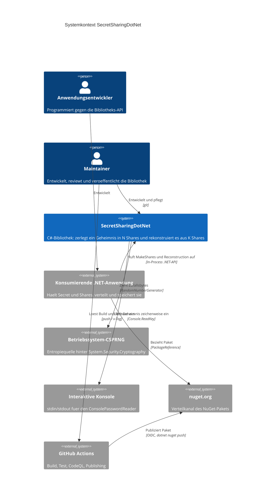
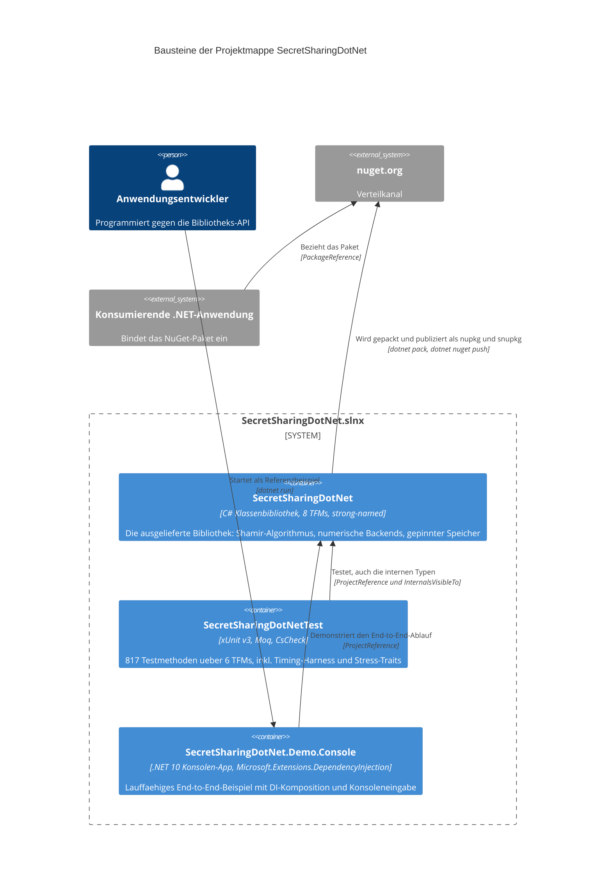
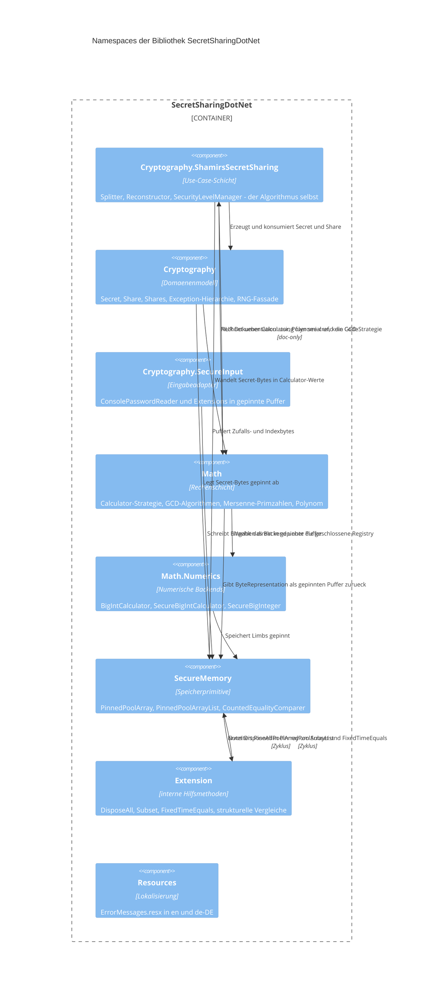
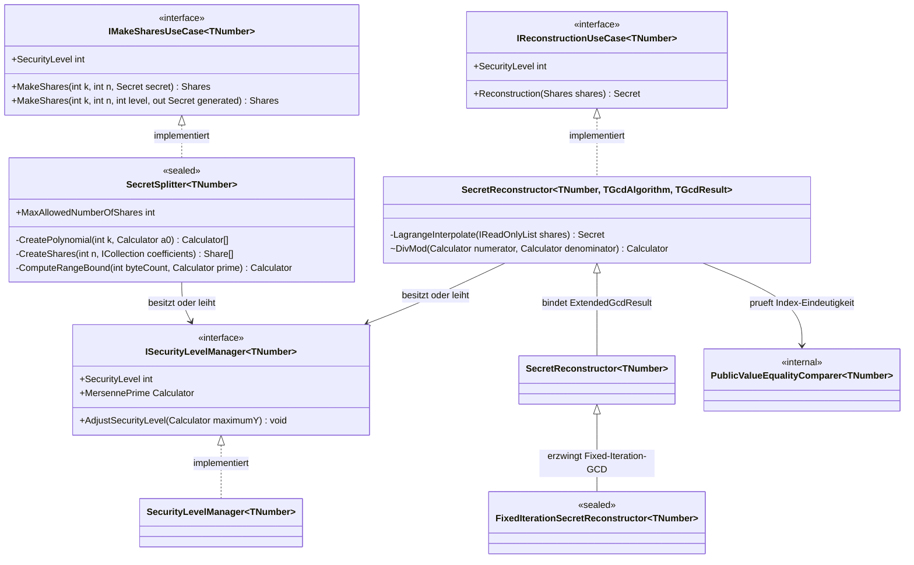
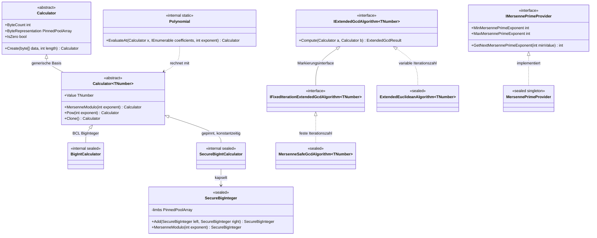
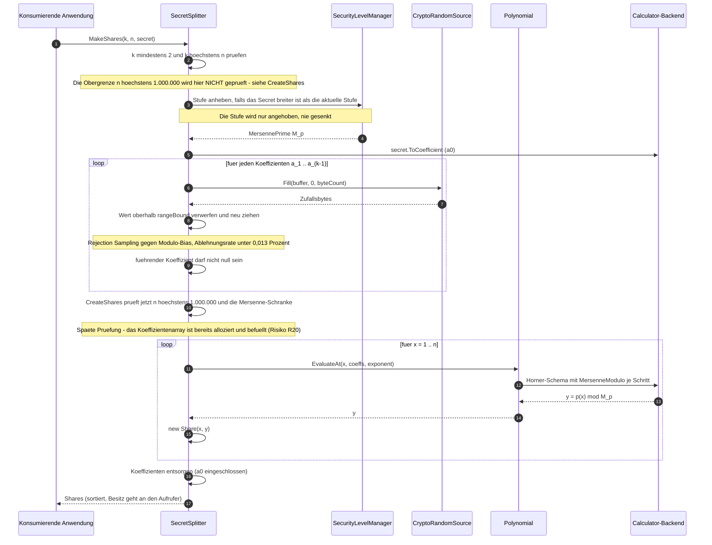
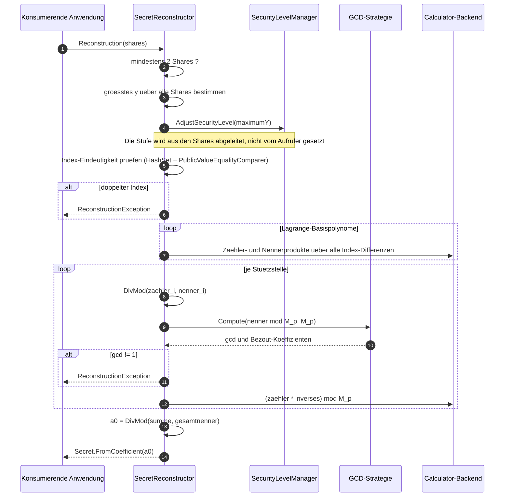
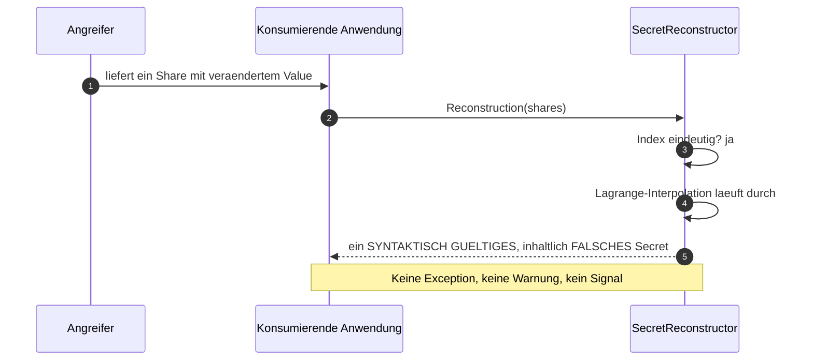
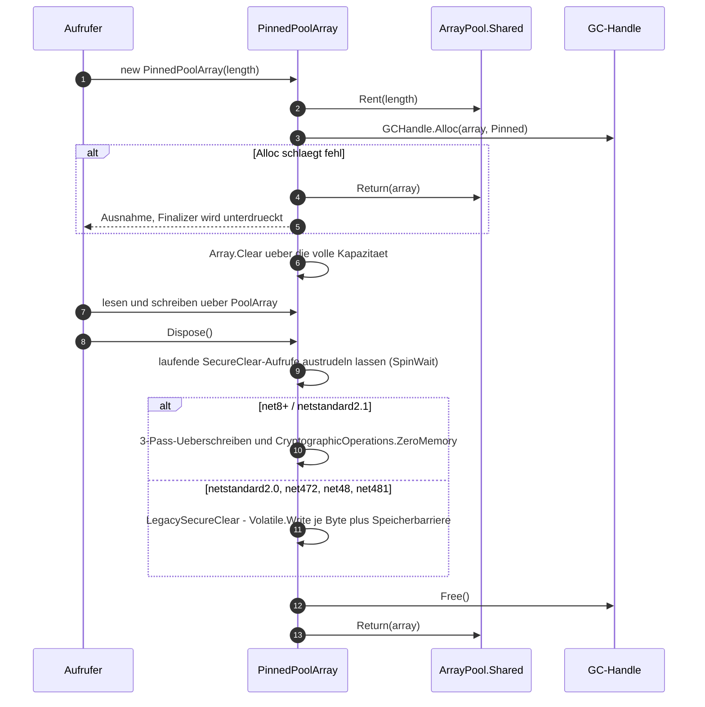
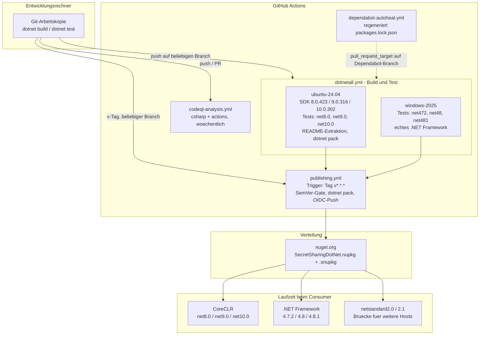

# Architekturdokumentation: SecretSharingDotNet

- Stand: 2026-09-12 · Version: 1.0
- Quellen: Codebasis auf `develop` (Commit `d920257`, 47 `.cs`-Dateien / 13.702 LOC in `src/`),
  `README.md` (inkl. Abschnitt *Security & Threat Model*), `CHANGELOG.md` (bis `[1.0.1]`,
  2026-08-24), die Testsuite unter `tests/` (56 `.cs`-Dateien, inklusive `tests/Timing/`),
  `.github/workflows/*.yml`, `samples/SecretSharingDotNet.Demo.Console/` sowie die öffentliche
  GitHub-Historie (Pull Requests und Issues, in den Kapiteln 9 und 11 mit Nummer zitiert). Jeder
  Verweis in diesem Dokument zeigt auf **versionierte oder öffentlich abrufbare** Inhalte; nicht
  versionierte lokale Arbeitsdateien und interne Arbeitsnotizen sind bewusst keine Quelle — was
  ein Leser nach `git clone` nicht vorfindet, trägt hier auch keine Aussage.
- Änderungen:
    - 2026-09-12 — Erstfassung, alle Kapitel.
    - 2026-09-12 — Kapitel 5.2 und 11 gegen den Codestand nachgezogen.
    - 2026-09-12 — Verweise auf nicht versionierte Arbeitsdateien entfernt; die davon getragenen
      Aussagen in den Kapiteln 1.2, 5.2, 8.2, 8.11, 10.2 und 11 auf versionierte Quellen
      (Testcode, CI-Workflows, `README.md`) umgehängt.
    - 2026-09-12 — interne Review-Kennungen (A…, SB/SEC/CR/PPA/SH…) aus den Kapiteln 5.2, 9 und 11
      entfernt; die Belegspalte nennt jetzt die Fundstelle im Code bzw. die öffentliche
      PR-/Issue-Nummer.
    - 2026-09-12 — Kapitel 2 um `.editorconfig` und `.gitattributes` ergänzt, Kapitel 7 um die
      Behandlung des Signaturschlüssels im Release-Pfad.
    - 2026-09-12 — Review-Nachlauf zu PR #399: Geheimhaltungsanspruch in 1.1 qualifiziert,
      Q1 auf den bibliothekseigenen Puffer eingegrenzt, Q6 nach Algorithmusgarantie und
      Testabdeckung getrennt.
    - 2026-09-13 — zweiter Review-Nachlauf zu PR #399: Pinned-Memory-Anspruch in 8.1 und Q2 auf
      das `SecureBigInteger`-Backend eingegrenzt, RNG-Inventar in 8.3 auf drei Ziehstellen
      vervollständigt, Validierungsreihenfolge in 6.1 korrigiert, Risiko R20 aufgenommen.
    - 2026-09-13 — dritter Review-Nachlauf zu PR #399: Löschpfad der vier Alt-TFMs
      (`LegacySecureClear`) an allen vier Fundstellen ergänzt, `main`-Herkunft im Release-Pfad als
      Konvention statt als Gate ausgewiesen.

Nach [arc42](https://arc42.org). Nicht belegbare Inhalte sind als **Offen:**-Blöcke markiert —
sie benennen die fehlende Information.

---

## 1. Einführung und Ziele

### 1.1 Aufgabenstellung

SecretSharingDotNet ist eine C#-Klassenbibliothek, die *Shamir's Secret Sharing* implementiert:
Ein Geheimnis (Text, Zahl oder Byte-Folge) wird in **N** Anteile (*Shares*) zerlegt, von denen
beliebige **K** Anteile genügen, um das Original wiederherzustellen — während **K−1** Anteile
praktisch keine Information über das Geheimnis preisgeben. *Praktisch*, nicht *perfekt*: Diese
Implementierung würfelt den führenden Polynomkoeffizienten bei einer Null neu, damit der Grad
exakt `K−1` bleibt und die effektive Schwelle nicht stillschweigend auf `K−1` fällt. Dadurch ist
dieser Koeffizient auf `[1, p−1]` statt auf `[0, p−1]` gleichverteilt, und `K−1` Anteile schließen
genau einen Kandidatenwert aus — ein Rest-Leck von `log₂(p / (p−1))` Bit. Bei `p = 2¹²⁷ − 1` ist
das jenseits jeder Messbarkeit, aber es ist nicht null; der Tausch ist bewusst (siehe
`SecretSplitter.CreatePolynomial`). Die Bibliothek richtet sich an
.NET-Entwicklerinnen und -Entwickler, die Schlüssel, Passwörter oder Recovery-Codes auf mehrere
Verwahrer aufteilen wollen, ohne einem einzelnen zu vertrauen.

Die Aufteilung selbst ist der eigentliche Zweck; **Verteilung, Speicherung und Transport der
Shares liegen außerhalb des Systems** und sind Aufgabe der konsumierenden Anwendung. Die
Bibliothek wird als NuGet-Paket ausgeliefert und läuft in-process in der Anwendung des
Konsumenten (Quelle: `README.md`, `src/SecretSharingDotNet.csproj`).

### 1.2 Qualitätsziele

| Priorität | Qualitätsziel | Motivation |
|---|---|---|
| 1 | **Vertraulichkeit des Geheimnisses im Prozessspeicher** | Der gesamte Nutzen der Bibliothek entfällt, wenn das Geheimnis aus Heap-Snapshots, Swap-Dateien oder wiederverwendeten Pool-Puffern rekonstruierbar bleibt. Umgesetzt über GC-gepinnte, dreifach überschriebene Puffer (`PinnedPoolArray<T>`) und eine durchgehende `IDisposable`-Disziplin. |
| 2 | **Funktionale Korrektheit des Schemas** | Ein falsch rekonstruiertes Geheimnis ist unbemerkt fatal: plain Shamir hat keine Integritätsprüfung (`README.md`, Threat Model). Abgesichert über 817 Testmethoden, property-basierte Round-Trip-Tests (CsCheck) und zwei parallele Testhierarchien für beide numerischen Backends. |
| 3 | **Resistenz gegen passive Timing-Analyse (best effort)** | Zweites, bewusst nachrangiges Sicherheitsziel: Das `SecureBigInteger`-Backend liefert konstantzeitige Kernarithmetik und einen Fixed-Iteration-Modularinversen. Der Anspruch ist explizit *best effort in managed .NET*, nicht auditierte Härtung (`README.md`, Abschnitt *Security & Threat Model*). |
| 4 | **Portabilität über acht Ziel-Frameworks** | Die Bibliothek soll in Legacy-.NET-Framework-Anwendungen ebenso einsetzbar sein wie in .NET 10. Kosten: umfangreiche `#if`-Konditionalisierung (siehe Risiko R1). |
| 5 | **Stabilität der öffentlichen API** | Nach dem v1.0-GA sollen Consumer nicht bei jedem internen Refactoring brechen. Umgesetzt über bewusste `internal`-Grenzen und SemVer-Disziplin im `CHANGELOG.md`. |

Priorität 1–3 steuern Kapitel 8 (Querschnittliche Konzepte) und Kapitel 10
(Qualitätsanforderungen); Priorität 4–5 steuern Kapitel 2 und 7.

### 1.3 Stakeholder

| Rolle | Erwartung |
|---|---|
| **Anwendungsentwickler (Consumer)** | Eine API, die sich nicht versehentlich unsicher benutzen lässt; verständliche Migrationshinweise bei Breaking Changes; lauffähige Beispiele (`samples/`, README). |
| **Maintainer** (Sebastian Walther, Einzelmaintainer) | Wartbarkeit bei begrenzter Zeit; grüne CI über alle acht TFMs als Freigabekriterium; nachvollziehbare Architekturentscheidungen. |
| **Sicherheitsreviewer / Auditor** | Ein ehrlich abgegrenztes Bedrohungsmodell — was geschützt ist, was ausdrücklich *nicht* (`README.md`, Abschnitt *Security & Threat Model*). |
| **Share-Inhaber (Domänenrolle)** | Verwahrt genau einen Anteil im Format `INDEX-VALUE` (hexadezimal). Interagiert nie direkt mit der Bibliothek — nur über die konsumierende Anwendung. |
| **CI/Release-Pipeline** | Deterministische, reproduzierbare Builds (Lock-Files, `--locked-mode`, `Deterministic=true`) und ein Publishing-Pfad ohne langlebige Secrets (OIDC). |

---

## 2. Randbedingungen

**Technisch**

| Randbedingung | Konsequenz |
|---|---|
| Ziel-Frameworks `netstandard2.0`, `netstandard2.1`, `net472`, `net48`, `net481`, `net8.0`, `net9.0`, `net10.0` | Jede Sprach- oder BCL-Neuerung muss per `#if` konditionalisiert werden (z. B. `Span<T>`, `CryptographicOperations.FixedTimeEquals`, `Convert.TryToBase64Chars`). |
| **Rein managed .NET** — kein natives Interop, keine P/Invoke-Abhängigkeit | Konstantzeit ist prinzipiell nur näherungsweise erreichbar (RyuJIT, GC, ArrayPool). Wird im Bedrohungsmodell offen benannt. |
| Laufzeit-Abhängigkeiten: nur `System.Buffers` auf `netstandard2.0` / `net4.7.2` / `net4.8` / `net4.8.1` | Keine transitive Krypto-Drittbibliothek; alles Weitere kommt aus der BCL. |
| Strong-Name-Signierung (`SecretSharingDotNet.snk`), `ComVisible(false)`, `CLSCompliant(true)` | Öffentliche Signaturen müssen CLS-konform bleiben; Tests erreichen `internal`-Typen nur über `InternalsVisibleTo` mit Public Key. |
| Zentrale Paketversionierung (`Directory.Packages.props`) mit `packages.lock.json` und `--locked-mode` in CI | Jedes Dependency-Update muss die Lock-Dateien über die volle TFM-Matrix regenerieren. |
| Einzelnes Assembly (`SecretSharingDotNet.dll`) | Schichtgrenzen sind eine *Konvention* über Namespaces, nicht durch den Compiler erzwungen (siehe Kapitel 5.2 und Risiko R6). |
| Code-Stil maschinenlesbar in `.editorconfig` (359 Zeilen, 161 `dotnet_`/`csharp_`-Regeln), aus der bestehenden Codebasis abgeleitet statt aus einer Vorlage | Severity durchgehend `suggestion`: Die IDE weist hin, der Build bleibt grün. Weder `EnforceCodeStyleInBuild` noch ein `dotnet format`-Schritt in der CI — der Stil ist per Review verbindlich, nicht per Werkzeug. |
| Zeilenenden normalisiert per `.gitattributes` (`* text=auto`; `.sh` und `.yml` fest auf `eol=lf`, `.snk`/`.gpg` als `binary`) | Das Repository speichert LF, der Arbeitsbaum bleibt plattformüblich. Skripte und Workflow-Dateien brauchen LF zur Ausführungszeit und sind darum explizit gepinnt. |

**Organisatorisch**

- Ein einzelner Maintainer; keine Team-Kapazität für parallele Arbeitsstränge. Größere
  Umbauten werden bewusst als „deferred“ geparkt statt angefangen (siehe Kapitel 11).
- Entwicklung auf `develop`, Release über `main` mit `v*`-Tag; Feature-Branches werden
  rebased, nicht zurückgemergt.
- CI ausschließlich GitHub Actions; keine selbstgehosteten Runner.

**Rechtlich**

- MIT-Lizenz (`LICENSE.md`, `PackageLicenseExpression=MIT`).
- Der Bernstein–Yang-„safegcd“-Algorithmus ist aus dem Paper (IACR ePrint 2019/266)
  implementiert, ausdrücklich **nicht** aus bestehendem Fremdcode (BoringSSL, libsodium) —
  dokumentiert in `MersenneSafeGcdAlgorithm.cs`, Abschnitt *Implementation provenance*.

---

## 3. Kontextabgrenzung

Die Bibliothek ist ein In-Process-Baustein ohne eigene Laufzeit, ohne Netzwerk- und ohne
Persistenzschicht. Ihre einzigen echten Außenschnittstellen sind die .NET-API gegenüber der
konsumierenden Anwendung, der CSPRNG des Betriebssystems und — optional — die interaktive
Konsole.



### Schnittstellen

| Partner | Ausgetauschte Daten | Kanal / Mechanismus |
|---|---|---|
| Konsumierende .NET-Anwendung | `Secret<TNumber>` hinein, `Shares<TNumber>` heraus (Split); `Shares<TNumber>` hinein, `Secret<TNumber>` heraus (Reconstruct) | In-Process-Methodenaufruf über `IMakeSharesUseCase<TNumber>` / `IReconstructionUseCase<TNumber>` |
| Konsumierende .NET-Anwendung (Serialisierung) | Ein Share als `INDEX-VALUE`, beide Teile hexadezimal; Secret optional als Base64 | `Share<TNumber>.ToCharArray()`, `Shares<TNumber>.ToCharArray()`, `Secret<TNumber>.ToBase64CharArray()` — jeweils in gepinnten Puffern |
| Betriebssystem-CSPRNG | Rohe Zufallsbytes für Polynomkoeffizienten, Zufallsgeheimnisse und das Markierungsbyte | `System.Security.Cryptography.RandomNumberGenerator` über die interne Fassade `SecureRandom` / `IRandomSource` |
| Interaktive Konsole | Tastendrücke des Benutzers, direkt in einen gepinnten `PinnedPoolArray<char>` | `Console.ReadKey(intercept: true)` in `ConsolePasswordReader` — es entsteht zu keinem Zeitpunkt ein managed `string` |
| nuget.org | `SecretSharingDotNet.nupkg` + `.snupkg` (Symbolpaket) | `dotnet nuget push` aus `publishing.yml`, Authentifizierung per OIDC |

**Bewusst außerhalb des Systems:** Verteilung der Shares an Verwahrer, deren Speicherung,
Integritätsschutz der Shares (keine VSS, keine MACs — siehe Risiko R9) und jegliche
Schlüsselverwaltung.

---

## 4. Lösungsstrategie

| # | Grundsatzentscheidung | Begründung und Wirkung |
|---|---|---|
| 1 | **Endliche Körper über Mersenne-Primzahlen** statt beliebiger Primzahlen | `MersennePrimeProvider` hält 43 bekannte Mersenne-Exponenten (13 bis 43.112.609). `M_p = 2^p − 1` erlaubt die Reduktion als Falten-und-Addieren (`MersenneModulo`) statt einer Division und macht die `2^{-n}`-Korrektur des safegcd-Inversen überhaupt erst möglich. Prägt Kapitel 5.4 und 6. |
| 2 | **Strategie-Muster für den numerischen Backend-Typ** (`Calculator<TNumber>`) | Entkoppelt den Shamir-Algorithmus vollständig vom Zahlentyp. Zwei Implementierungen: `BigIntCalculator` (BCL-`BigInteger`, schnell, variable Laufzeit) und `SecureBigIntCalculator` über das eigene `SecureBigInteger` (gepinnt, konstantzeitige Kernarithmetik). Der Consumer wählt über den Typparameter. |
| 3 | **Gepinnter, sicher gelöschter Speicher als Default-Träger jedes Geheimnisses** | `PinnedPoolArray<T>` ist die einzige Ablage für Secret-Bytes, Share-Zeichen, Konsoleneingaben und `SecureBigInteger`-Limbs. Erzwingt die `IDisposable`-Disziplin quer durch die gesamte API (Qualitätsziel 1). |
| 4 | **Zwei Rekonstruktor-Varianten statt eines Schalters** | `SecretReconstructor<TNumber>` nimmt jede GCD-Strategie (auch die variabelzeitige `ExtendedEuclideanAlgorithm`). `FixedIterationSecretReconstructor<TNumber>` akzeptiert nur `IFixedIterationExtendedGcdAlgorithm<TNumber>` — die gefährliche Paarung „SecureBigInteger + Euklid“ ist damit ein **Compile-Fehler**, keine stille Schwäche. |
| 5 | **Use-Case-Interfaces als öffentliche Einstiegspunkte** | `IMakeSharesUseCase<TNumber>` und `IReconstructionUseCase<TNumber>` erben `IDisposable` und sind DI-fähig; die konkreten Typen sind `sealed`. Komposition statt Vererbung ist die vorgesehene Erweiterungsrichtung. |
| 6 | **Redaction by default** | `ToString()` auf `Secret`, `Share` und `Shares` liefert im Release-Build die Sentinel-Zeichenkette `"*** Secured Value ***"`; nur die expliziten `ToCharArray()`-Pfade geben echten Inhalt heraus. Verhindert Leaks über Logs, Exception-Texte und Debugger-Anzeigen. |
| 7 | **UTF-8 als Textkodierung** (seit v0.14.0, Breaking Change) | Plattformneutraler Standard; das frühere UTF-16 war ein .NET-Artefakt. Überladungen mit explizitem `Encoding` existieren, die Kodierung wird aber **nicht** im Share persistiert (siehe Risiko R11). |
| 8 | **Geschlossene Backend-Registry statt Reflexion** | `Calculator.Create<TNumber>()` löst über ein explizites `IReadOnlyDictionary<Type, BackendRegistration>` auf. Trimming- und NativeAOT-tauglich, frei von statischer Initialisierungsreihenfolge (ADR-Kandidat 1 in Kapitel 9). |

---

## 5. Bausteinsicht

### 5.1 Whitebox Gesamtsystem (Ebene 1)

Die Projektmappe `SecretSharingDotNet.slnx` enthält genau drei Projekte. Nur das erste wird
ausgeliefert.



| Baustein | Verantwortung | Technologie |
|---|---|---|
| **SecretSharingDotNet** | Die gesamte fachliche und kryptografische Logik. Einziges Artefakt mit öffentlicher API. | C#, `LangVersion=latest`, 8 TFMs, `AllowUnsafeBlocks`, `GenerateDocumentationFile` |
| **SecretSharingDotNetTest** | Verifikation über 6 TFMs (`netstandard`-Ziele werden über die konkreten Frameworks mitgetestet). Enthält zwei gespiegelte Testhierarchien — eine je numerischem Backend. | xUnit v3, Moq, CsCheck (nur net8+) |
| **SecretSharingDotNet.Demo.Console** | Referenz-Komposition: `SecureBigInteger` + `FixedIterationSecretReconstructor` + `ConsolePasswordReader`, verdrahtet über `Microsoft.Extensions.DependencyInjection` mit `ValidateOnBuild`/`ValidateScopes`. Nicht paketiert (`IsPackable=false`). | .NET 10, MS.DI |

### 5.2 Whitebox der Bibliothek (Ebene 2)

Die Bibliothek ist ein einzelnes Assembly; die Bausteine sind Namespaces. Das Diagramm zeigt die
**tatsächlichen** Abhängigkeiten aus den `using`-Direktiven — einschließlich der beiden
Auffälligkeiten.



| Baustein | Verantwortung | Öffentlich? |
|---|---|---|
| `Cryptography.ShamirsSecretSharing` | Aufteilen (`SecretSplitter<TNumber>`), Rekonstruieren (`SecretReconstructor<…>`, `FixedIterationSecretReconstructor<TNumber>`), Sicherheitsstufe verwalten (`SecurityLevelManager<TNumber>`). | ja |
| `Cryptography` | `Secret<TNumber>` (readonly struct über gepinntem Puffer), `Share<TNumber>` (sealed record, Paar aus `Index` und `Value`), `Shares<TNumber>` (sortierte, schreibgeschützte Sammlung), Exception-Hierarchie, interne RNG-Fassade. | ja (RNG-Teile `internal`) |
| `Cryptography.SecureInput` | Eingabe ohne `string`-Materialisierung: `ConsolePasswordReader`, `SecureCharBufferExtensions`, `SecureNumericBufferExtensions`. | ja |
| `Math` | `Calculator`/`Calculator<TNumber>` (Strategie + geschlossene Backend-Registry), `Polynomial.EvaluateAt` (Horner-Schema), `ExtendedEuclideanAlgorithm<TNumber>`, `MersenneSafeGcdAlgorithm<TNumber>`, `MersennePrimeProvider`. | ja (`Polynomial` ist `internal`) |
| `Math.Numerics` | `SecureBigInteger` (2.753 LOC, gepinnte `ulong`-Limbs, konstantzeitige Kernoperationen) und die beiden `Calculator`-Implementierungen. | `SecureBigInteger` ja, die Calculator `internal` |
| `SecureMemory` | `PinnedPoolArray<T>`: `ArrayPool`-Miete + `GCHandle.Alloc(Pinned)` + 3-Pass-Überschreiben + `CryptographicOperations.ZeroMemory` beim Dispose (auf `netstandard2.0`/`net472`/`net48`/`net481` stattdessen `LegacySecureClear` mit `Volatile.Write` und Speicherbarriere), mit Nebenläufigkeitszähler. | ja |
| `Extension` | Ausschließlich `internal`: `DisposeAll`, `Subset<T>`, `FixedTimeEquals`, strukturelle Vergleichshelfer. | nein |
| `Resources` | `ErrorMessages.resx` (neutral/en) und `ErrorMessages.de-DE.resx`, je 55 Schlüssel. Alle Ausnahmetexte stammen von hier, nie inline. | `internal` |

**Zwei ehrliche Auffälligkeiten im Diagramm:**

1. `Math → Cryptography.ShamirsSecretSharing` ist eine **reine Dokumentationskante**. In
   `MersenneSafeGcdAlgorithm.cs:33` existiert `using Cryptography.ShamirsSecretSharing;`
   ausschließlich, damit die `<see cref="SecretReconstructor{…}"/>`-Verweise im XML-Kommentar
   auflösen. Außerhalb von Kommentaren wird kein Typ aus diesem Namespace referenziert
   (verifiziert). Der Compiler sieht dennoch eine Abhängigkeit nach „oben“.
2. `SecureMemory ↔ Extension` ist ein **echter Namespace-Zyklus**:
   `SecureMemory/PinnedPoolArrayList.cs` ruft `DisposeAll()` aus `Extension` auf, während
   `Extension/PinnedPoolArrayExtensions.cs` `PinnedPoolArray<T>` erweitert. Beide Seiten sind
   `internal`, der Zyklus ist damit nicht Teil der öffentlichen API — aber er existiert.

Die frühere Aufwärtskante `Math → Cryptography.SecureArray` wurde in v1.0.1 aufgelöst, indem die
Speicherprimitive in den neutralen Top-Level-Namespace `SecureMemory` verschoben wurden
(`CHANGELOG.md` `[1.0.1] → Changed`; PR #375).

### 5.3 Whitebox `Cryptography.ShamirsSecretSharing` (Ebene 3)



Bemerkenswert an dieser Ebene:

- **Der Typ trägt die Sicherheitsgarantie.** `FixedIterationSecretReconstructor<TNumber>` nimmt
  im Konstruktor ausschließlich `IFixedIterationExtendedGcdAlgorithm<TNumber>` entgegen; der
  parameterlose Konstruktor setzt `MersenneSafeGcdAlgorithm<TNumber>` ein. Die riskante
  Kombination aus `SecureBigInteger` und variabelzeitigem Euklid lässt sich so gar nicht erst
  übersetzen.
- **Besitz der Sicherheitsstufe ist explizit.** Splitter und Reconstructor merken sich in einem
  `ownsSecurityLevelManager`-Flag, ob sie den Manager selbst erzeugt haben — nur dann
  entsorgen sie ihn mit.
- **`SecretReconstructor.SecurityLevel` ist schreibgeschützt.** Jeder
  `Reconstruction`-Aufruf ruft `AdjustSecurityLevel(maximumY)` und überschreibt eine vom
  Aufrufer gesetzte Stufe ohnehin; ein Setter wäre eine Lüge.
- **`PublicValueEqualityComparer<TNumber>`** existiert, weil `SecureBigInteger.GetHashCode`
  bewusst nur öffentliche Metadaten (Vorzeichen + Limb-Anzahl) hasht. Ohne diesen Comparer
  würden alle kleinen Share-Indizes in denselben Bucket fallen und die Eindeutigkeitsprüfung auf
  O(n²) fallen (`CHANGELOG.md` `[1.0.1] → Fixed`).

### 5.4 Whitebox `Math` (Ebene 3)



- `Calculator.Create<TNumber>(byte[], int)` löst den Backend-Typ über eine **geschlossene**
  `Dictionary<Type, BackendRegistration>` auf. Bei Typkonflikt wird die verwaiste Instanz
  entsorgt und eine `NotSupportedException` geworfen — es gibt bewusst keine öffentliche
  Registrierungs-API.
- `MersenneSafeGcdAlgorithm` ist **zustandslos** und leitet den Mersenne-Exponenten zur
  Aufrufzeit aus dem übergebenen Modulus ab. Es hält keine Referenz auf einen
  `ISecurityLevelManager` und kann darum nicht gegenüber dem konsumierenden Rekonstruktor
  driften.
- `MersennePrimeProvider` ist ein `Lazy`-Singleton über einem unveränderlichen `int[]` — damit
  im Hot Path thread-sicher lesbar.

---

## 6. Laufzeitsicht

### 6.1 Geheimnis aufteilen (`MakeShares`)

Der wichtigste Ablauf. Er zeigt zugleich, wo Zufall eintritt und wo die Sicherheitsstufe
automatisch angehoben wird.



Zwei nicht offensichtliche Details:

- Die x-Koordinate wird über `BinaryPrimitives.WriteInt32LittleEndian` kodiert, damit beide
  `Calculator`-Backends — die Bytes als vorzeichenbehaftetes Zweierkomplement in Little-Endian
  lesen — unabhängig von der Host-Endianness dieselbe Zahl sehen.
- `numberOfShares` muss **kleiner als die Mersenne-Primzahl** sein, sonst kollidieren
  Share-Indizes modulo `M_p` und die Lagrange-Division würde durch null teilen. Der Splitter
  prüft das vorab und wirft eine `ArgumentOutOfRangeException`, die das tatsächlich falsche
  Argument benennt.

### 6.2 Geheimnis rekonstruieren (`Reconstruction`)



Die Rekonstruktion wertet das Lagrange-Interpolationspolynom an `x = 0` aus; das Ergebnis ist
genau der konstante Term `a₀` — das Geheimnis. Alle Zwischenwerte sind `Calculator`-Instanzen
und werden auf jedem Pfad (auch dem Fehlerpfad) über `try/finally` entsorgt.

### 6.3 Kritischer Fehlerfall: manipuliertes Share

Der wichtigste Ablauf, den die Bibliothek **nicht** abfängt — er gehört in diese Dokumentation,
weil er die Erwartungshaltung der Consumer prägt.



Plain Shamir trägt keine Integritätsprüfung pro Share. Die Bibliothek implementiert weder
Verifiable Secret Sharing (Feldman, Pedersen) noch Per-Share-MACs. Consumer, deren
Bedrohungsmodell Share-Manipulation einschließt, müssen ein eigenes Integritätsverfahren
darüberlegen — signierte Shares, HMAC-Umschläge oder VSS (`README.md`, *Security & Threat
Model*; Risiko R9).

### 6.4 Lebenszyklus des gepinnten Speichers



Die Reihenfolge *löschen → entpinnen → zurückgeben* ist sicherheitskritisch: Würde der Puffer
vor dem Löschen an den Pool zurückgehen, könnte ein anderer Mieter Klartext lesen. Der
`activeOperations`-Zähler verhindert, dass ein nebenläufiger `SecureClear` noch in einen bereits
zurückgegebenen Puffer schreibt.

---

## 7. Verteilungssicht

Die Bibliothek hat keine eigene Betriebsumgebung — sie läuft im Prozess des Consumers. „Verteilt“
werden das NuGet-Paket und die CI-Läufe.



| Knoten | Zweck | Besonderheit |
|---|---|---|
| `ubuntu-24.04` | Build, Tests der CoreCLR-TFMs, Paketbau | Ohne Mono — die .NET-Framework-Suiten können hier nicht laufen. Prüft zusätzlich, dass die beiden README-Überschriften, aus denen der Paket-README extrahiert wird, genau einmal vorkommen. |
| `windows-2025` | Tests der TFMs `net472`, `net48`, `net481` | Läuft gegen das echte .NET Framework, nicht gegen Mono. |
| `publishing.yml` | Release | Startet bei Tags der Form `v[0-9]+.[0-9]+.[0-9]+*` — **unabhängig davon, welcher Branch den getaggten Commit enthält**. Es gibt weder einen Branch-Filter noch eine Ancestry-Prüfung gegen `main`; dass Releases von `main` kommen, ist Maintainer-Konvention, kein erzwungenes Gate. Was tatsächlich schützt, ist der Gleichlauf von Tag und Versionsangaben (siehe unten); die eigentliche SemVer-Validierung erfolgt in einem eigenen Schritt, weil GitHubs Filter-Globs SemVer nicht ausdrücken können. Push an nuget.org über OIDC statt langlebigem API-Key. Nebenläufigkeit pro Ref, **ohne** `cancel-in-progress` — ein zwischen Pack und Push abgebrochener Release wäre halb veröffentlicht. |
| `dependabot-autoheal.yml` | Reparatur | Dependabots NuGet-Updater schreibt eine `packages.lock.json` mit nur einem Framework-Abschnitt zurück, was den `--locked-mode`-Restore mit NU1004 brechen lässt. Der Workflow regeneriert die Lock-Dateien über die volle TFM-Matrix und pusht sie in den PR. |

**Der Release-Pfad behandelt seine beiden Geheimnisse unterschiedlich.** Der Push an nuget.org
läuft über OIDC und braucht darum gar kein langlebiges Token. Der Strong-Name-Schlüssel dagegen
liegt GPG-verschlüsselt im Repository (`.github/secrets/SecretSharingDotNetPublisher.snk.gpg`) und
wird zur Laufzeit über `decrypt_publisher_snk.sh` entschlüsselt. Die Reihenfolge ist bewusst
gewählt: Der Schritt *Verify tag matches package version* — er prüft `<Version>`,
`AssemblyInformationalVersion` und den Tag-Link in `PackageReleaseNotes` gegen den Tag — läuft
**vor** der Entschlüsselung. Ein Tag, der nicht zum gepackten Stand passt, bricht den Lauf ab,
bevor der Signaturschlüssel überhaupt im Klartext existiert.

**Lokale Entwicklung** weicht in einem Punkt ab: Auf Linux/macOS brauchen die
Framework-TFMs `mono-complete`. Mono 6.8 schreibt dabei gelegentlich
`mono_crash.*.json`-Dateien nach `tests/` — Artefakte des Runner-Shutdowns *nach* der
Assertion-Auswertung, keine Bibliotheksfehler; per `.gitignore` ausgeblendet
(`README.md`, *CLI building instructions*).

> **Offen:** `dependabot.yml` wird von GitHub ausschließlich vom Default-Branch gelesen. Wie der
> Sync-Zeitpunkt zwischen `develop` und `main` für Konfigurationsänderungen an Workflows
> organisiert ist, ist nirgends im Repository dokumentiert. Benötigt: eine kurze
> Release-Checkliste im Repository (heute existiert sie nur als Arbeitsnotiz).

---

## 8. Querschnittliche Konzepte

### 8.1 Sicherer Speicher und Besitzverhältnisse

Geheimnistragende Bytes leben in einem `PinnedPoolArray<T>`: aus `ArrayPool<T>.Shared`
gemietet, über `GCHandle` gepinnt (damit der GC es nicht relokiert und dabei Kopien
hinterlässt), beim Dispose dreifach überschrieben und mit
`CryptographicOperations.ZeroMemory` genullt. Auf den vier Alt-Zielen `netstandard2.0`,
`net472`, `net48` und `net481` gibt es `ZeroMemory` nicht; dort übernimmt `LegacySecureClear`
mit `Volatile.Write` je Byte und abschließender Speicherbarriere (`SecureClearCore`, gesteuert
über `#if NET8_0_OR_GREATER || NETSTANDARD2_1_OR_GREATER`).

**Dieser Anspruch gilt vollständig nur für das `SecureBigInteger`-Backend.** Wer `BigInteger`
wählt, bekommt ihn nicht: `BigIntCalculator.ByteRepresentation` (`BigIntCalculator.cs:318`) ruft
`Value.ToByteArray()` und kopiert das Ergebnis erst danach in einen gepinnten Puffer. Das
Zwischenarray ist eine gewöhnliche, verschiebbare verwaltete Allokation mit
geheimnisabgeleitetem Inhalt, die niemand pinnt und niemand überschreibt — ebenso wie der
interne Magnitude-Puffer von `System.Numerics.BigInteger` selbst. Das ist keine Nachlässigkeit,
sondern die Konsequenz daraus, einen BCL-Werttyp als Backend anzubieten; die
Backend-Tabelle der `README.md` führt `BigInteger` deshalb mit *Pinned memory: no*. Für
Geheimnisse, bei denen passive Speicheroffenlegung im Bedrohungsmodell steht, ist `BigInteger`
die falsche Wahl. Die Löschroutine trägt
`[MethodImpl(NoInlining | NoOptimization)]`, damit der JIT sie nicht wegoptimiert — dasselbe
Muster, das die BCL für `FixedTimeEquals` verwendet.

Daraus folgt eine **strenge Einzelbesitzer-Disziplin**, die quer durch die API gilt:

- `Secret<TNumber>`, `Share<TNumber>`, `Shares<TNumber>`, `Calculator`, `SecureBigInteger`,
  `ExtendedGcdResult<TNumber>` und beide Use-Case-Interfaces sind `IDisposable`.
- Besitz wird explizit übertragen: Ein `Share` besitzt seine beiden `Calculator`, eine
  `Shares`-Sammlung besitzt ihre Shares und entsorgt sie kaskadierend.
- Wer einen Manager *geliehen* bekommt, entsorgt ihn nicht — dafür existiert das
  `ownsSecurityLevelManager`-Flag.
- `Secret<TNumber>` ist ein `readonly struct` über einem Referenztyp-Puffer. Eine Struct-Kopie
  aliast denselben Puffer; `Dispose` auf *irgendeiner* Kopie entwertet alle. Der XML-Kommentar
  benennt das ausdrücklich und empfiehlt, den Typ nicht über Dispose-Grenzen hinweg per Wert zu
  reichen. Die Migration zu einer `sealed class` ist für den nächsten Breaking-Change-Zyklus
  vorgemerkt (Risiko R7).

### 8.2 Konstante Laufzeit — Reichweite und Grenzen

Der Anspruch ist präzise abgegrenzt; verbindlich formuliert ist er im Abschnitt
*Security & Threat Model* der `README.md` und in den XML-Kommentaren an
`MersenneSafeGcdAlgorithm` und `SecureBigInteger`:

| Geschützt | Nicht geschützt |
|---|---|
| Kernarithmetik von `SecureBigInteger` (`Add`, `Subtract`, `Multiply`, `Square`, `Divide`, `Remainder`) — feste Limb-Anzahl `max(l, r)`, verzweigungsfreie Übertragsformeln | `Pow(int)` — variabel über den *Exponenten* (der als öffentlich gilt) |
| `MersenneModulo` — konstant über den öffentlichen Mersenne-Exponenten und die Limb-Anzahl | Hex- und Base64-Dekoder (`Share.GetHexValue`, `Secret.DecodeBase64Char`) — verzweigende Bereichs-Switches, als Randparser eingestuft |
| `Equals` auf `SecureBigInteger` und `Secret` — Vorab-Auffüllen auf gleiche Länge, XOR-OR-Fold, einheitlich über alle sechs TFMs | `Secret.CompareTo` und die Operatoren `<`, `>`, `<=`, `>=` — brechen beim ersten abweichenden Byte ab und verraten die Länge des gemeinsamen Präfixes |
| `GetHashCode` — hasht nur öffentliche Metadaten (Vorzeichen + Limb-Anzahl bzw. Nutzlastlänge), nie Inhalte | Äußere Iterationszahl des Modularinversen hängt an der *gewählten Sicherheitsstufe*, die aus den Share-Größen ohnehin ablesbar ist |
| Äußere Iterationszahl von `MersenneSafeGcdAlgorithm` — fix am öffentlichen Mersenne-Exponenten | Per-Iteration-Laufzeit desselben Algorithmus ist **nicht** uniform (unterschiedliche Allokationszahl je divstep-Zweig) |

Die variabelzeitigen Zahlentheorie-Methoden (`Gcd`, `ModPow`, `Log`, `Log10`, `Log2`) wurden aus
`SecureBigInteger` **entfernt**, damit man sie nicht versehentlich auf Geheimmaterial anwenden
kann. Die Oberfläche ist bewusst schmal.

### 8.3 Zufall

Jede Zufallsziehung geht über `System.Security.Cryptography.RandomNumberGenerator`, gekapselt in
der internen Fassade `SecureRandom` hinter dem Interface `IRandomSource` (Standardimplementierung
`CryptoRandomSource.Instance`, zustandslos und thread-sicher). Es gibt kein `System.Random` und
keinen selbstgebauten PRNG. Das Interface ist **bewusst `internal`** — eine öffentlich
injizierbare RNG-Quelle in einer Secret-Sharing-Bibliothek wäre ein Fußangel-Design; Tests
erreichen sie über `InternalsVisibleTo`.

Drei Stellen ziehen Zufall:

1. Die **Polynomkoeffizienten** `a₁…a_{k−1}` (`SecretSplitter<TNumber>.CreatePolynomial`, Zeile 387), mit Rejection Sampling
   gegen Modulo-Bias und einer Neuziehung, falls der führende Koeffizient null wäre.
2. Das **Markierungsbyte** am Ende jedes Secrets (`Secret<TNumber>`-Konstruktor, Zeile 193), das negative Werte in der
   Zweierkomplement-Interpretation verhindert.
3. Das **Geheimnis selbst**, wenn es die Bibliothek erzeugt (`Secret<TNumber>.CreateRandom`, Zeile 1131): Die Überladung
   `MakeShares(k, n, securityLevel, out generatedSecret)` füllt über `CreateRandom` volle
   `prime.ByteCount` Bytes, bevor der Konstruktor unabhängig davon das Markierungsbyte zieht.
   Das ist die sicherheitskritischste der drei Stellen — hier entsteht das Geheimnis, nicht nur
   seine Maskierung.

### 8.4 Fehlerbehandlung

Seit v1.0.1 gibt es eine eigene Domänen-Hierarchie:

```
Exception
└── SecretSharingException          (Wurzel: jeder Shamir-Domänenfehler)
    ├── InvalidShareException       (fehlerhaft formatiertes Share beim Parsen)
    └── ReconstructionException     (gültige Shares, aber nicht rekonstruierbar)
```

Bewusst **nicht** Teil der Hierarchie: reine Argumentprüfungen auf direkt übergebenen Werten
(negativer Index, weniger als zwei Shares, ungültige Sicherheitsstufe). Sie bleiben bei der
`ArgumentException`-Familie. Eine `SecurityLevelException` wurde erwogen und verworfen — ihre
Kandidatenstellen sind echte Argument-Guards.

Alle Ausnahmetexte stammen aus `Resources/ErrorMessages.resx`; ein hartkodierter Text in `src/`
gilt als Regelverstoß.

### 8.5 Lokalisierung

Zwei Ressourcendateien mit je 55 Schlüsseln: `ErrorMessages.resx` (neutral, `en` per
`NeutralResourcesLanguage`) und `ErrorMessages.de-DE.resx`. Der Abgleich beider Schlüsselmengen
erfolgt **von Hand**; ein Build-Check existiert nicht (Risiko R10).

### 8.6 Redaction und Diagnose

`ToString()` auf `Secret`, `Share` und `Shares` ist build-modus-abhängig: Im DEBUG-Build liefert
es den echten Inhalt (für Debugger und `[DebuggerDisplay]`), im Release-Build die Zeichenkette
`"*** Secured Value ***"`. Wer Inhalt braucht, muss den expliziten Pfad
`ToCharArray()` / `ToBase64CharArray()` wählen — der gibt in beiden Build-Modi echten Inhalt
zurück, dafür in gepinntem Speicher, den der Aufrufer entsorgt.

### 8.7 Serialisierungsformat

Ein Share serialisiert als `INDEX-VALUE`, beide Teile hexadezimal, Trennzeichen `-`. Mehrere
Shares werden zeilenweise aneinandergereiht. Das Format enthält **keine** Metadaten: weder
Sicherheitsstufe noch Schwellwert `k`, noch die Textkodierung des ursprünglichen Geheimnisses.
Die Sicherheitsstufe wird bei der Rekonstruktion aus dem größten y-Wert zurückgerechnet; `k`
ergibt sich implizit daraus, wie viele Shares der Aufrufer beibringt; die Kodierung ist
Aufrufer-Verantwortung (Risiko R11).

### 8.8 Mehrfachziel-Kompilierung

Ein einziger Quellbaum bedient acht TFMs. Konditionalisiert wird über
`#if NET8_0_OR_GREATER`, `#if NETSTANDARD2_1_OR_GREATER` und `#if DEBUG`. Typische Fälle:
`Span<T>`-Überladungen, `CryptographicOperations.ZeroMemory` gegen eine
`Volatile.Write`-basierte Ersatzimplementierung, `Convert.TryToBase64Chars` gegen einen inline
ausprogrammierten 24-Bit-Fenster-Encoder, `[Serializable]`-Konstruktoren hinter
`#if !NET8_0_OR_GREATER` wegen SYSLIB0051.

### 8.9 Nebenläufigkeit

Der Vertrag ist **asymmetrisch** und muss beim Einsatz beachtet werden:

- **Thread-sicher:** `MersennePrimeProvider.Instance` (unveränderliches `int[]` hinter `Lazy`),
  `Calculator.Create` (Lesen aus einer schreibgeschützten Registry),
  `CryptoRandomSource.Instance`, alle `Dispose`-Pfade (`Interlocked.Exchange`-Flags),
  `SecurityLevelManager` intern (`lock` um den Prime-Tausch).
- **Nicht thread-sicher:** eine **geteilte** `SecretSplitter`- oder
  `SecretReconstructor`-Instanz. Beide lesen und schreiben bei jedem Aufruf die
  Sicherheitsstufe; nebenläufige Aufrufe auf derselben Instanz können falsche Ergebnisse
  liefern. Deshalb registriert die README-DI-Anleitung die Use-Cases als `Transient` bzw.
  `Scoped` und nur die zustandslose GCD-Strategie als `Singleton`.

Die Stress-Tests (`Category=Stress`) prüfen ausdrücklich nur das *unterstützte* Szenario —
je Thread eigene Instanzen. Ein geteilter Splitter wird bewusst nicht als sicher behauptet.

### 8.10 Dependency Injection

Beide Use-Case-Interfaces sind konstruktor-injizierbar; das Demo-Projekt zeigt die Verdrahtung
mit `Microsoft.Extensions.DependencyInjection` inklusive `ValidateOnBuild` und `ValidateScopes`.
Die Bibliothek liefert jedoch **keine** eigene `AddShamirsSecretSharing()`-Registrierung —
Consumer verdrahten von Hand (Risiko R5).

### 8.11 Testkonventionen

Die Konventionen stehen in keinem eigenen Dokument, sondern ergeben sich aus der Testsuite
selbst und aus der Testausführung in `.github/workflows/dotnetall.yml`. Die folgenden Zahlen sind
am Codestand `d920257` über die 56 versionierten Testdateien gemessen:

- **AAA-Marker** (`// Arrange` / `// Act` / `// Assert`) gliedern die Testkörper: 763 `// Arrange`-
  und 741 `// Act`-Marker in 43 der 56 Testdateien. Einzeilige `Assert.Throws`-Tests kommen ohne
  aus; wo Aktion und Prüfung untrennbar sind, steht ein zusammengezogenes `// Act & Assert`.
- **Jede Allokation bindet per `using`** — auch Operator-Ergebnisse (`+`, `-`, `*`, `/`, `%`),
  `Calculator<T>.Zero/One/Two`, Inline-Erwartungswerte und Schleifen-Zwischenwerte; 1.209
  `using var`-Deklarationen auf 817 Testmethoden. Ein vergessenes `using` hält einen gepinnten
  Puffer bis zum AppDomain-Ende am Leben.
- **Zwei gespiegelte Testhierarchien**, je eine für `BigInteger` und `SecureBigInteger` — sichtbar
  an den Geschwisterverzeichnissen `tests/Cryptography/{BigInteger,SecureBigInteger}/`,
  `tests/Cryptography/ShamirsSecretSharing/{BigInteger,SecureBigInteger}/` und
  `tests/Math/{BigInteger,SecureBigInteger}/`. Weicht eine Seite ab, ist das ein Frühwarnsignal
  für API-Drift zwischen den Backends.
- **Einzelthread-Ausführung**: Jeder der zwölf `dotnet test`-Aufrufe in
  `.github/workflows/dotnetall.yml` und `.github/workflows/publishing.yml` — und ebenso die
  CLI-Anleitung der `README.md` — setzt `RunConfiguration.MaxCpuCount=1`,
  `xUnit.AppDomain=denied`, `xUnit.ParallelizeAssembly=false` und
  `xUnit.ParallelizeTestCollections=false`. Nötig, damit timing- und speichersensible Invarianten
  deterministisch greifen.
- Der **Timing-Harness** (`tests/Timing/`, nur net8+) misst gepaarte Laufzeiten und wertet sie mit
  Welchs t-Test aus; die Signifikanzschwelle steht als Vorgabewert `pThreshold = 0.001` in
  `tests/Timing/DudectStyleClassifier.cs:58`. Er läuft als **Negativkontrolle**: Die einzige mit
  `[Trait("Category", "Timing")]` markierte Testmethode ist
  `HarnessSelfTest.Multiply_OnDistinctOperandSizes_DetectedAsVariableTime`, und sie muss eine
  bekannt variabelzeitige Operation als solche erkennen. Positive CT-Behauptungstests sind bewusst
  *nicht* Teil der Suite — in rein verwaltetem .NET liegt der Rauschboden aus ArrayPool-,
  Pinning- und JIT-Effekten über der Empfindlichkeitsschwelle des Tests. Die CT-Eigenschaft wird
  darum **strukturell** im Code-Review verteidigt, nicht statistisch.

> **Offen:** Keine dieser Konventionen ist maschinell erzwungen — es gibt weder einen Analyzer
> noch einen CI-Schritt, der AAA-Marker, `using`-Bindung oder die Spiegelung der beiden
> Testhierarchien prüft, und keine versionierte Datei, die sie normativ festschreibt. Oben steht
> eine Messung am Ist-Stand, keine Garantie. Benötigt: die Entscheidung, ob die Konventionen
> verbindlich sein sollen — und wenn ja, ein Analyzer-Regelsatz oder CI-Check plus ein
> versioniertes Konventionsdokument, auf das dieses Kapitel verweisen kann.

---

## 9. Architekturentscheidungen

| ADR | Titel | Status | Link |
|---|---|---|---|
| — | — | — | — |

> **Offen:** Das Repository enthält **keine ADRs**. Es gibt weder ein `docs/decisions/`- noch
> ein `docs/adr/`-Verzeichnis. Die Entscheidungen sind heute über `CHANGELOG.md`,
> XML-Kommentare, den README-Abschnitt *Security & Threat Model* und interne Arbeitsnotizen
> verstreut — nachvollziehbar, aber nicht als Entscheidung mit Kontext, Optionen und Konsequenzen
> dokumentiert. Benötigt: je ein ADR (MADR-Format, DE/EN-Paar) für die unten gelisteten
> Kandidaten.

**Kandidaten für nachzudokumentierende Entscheidungen** (belegt, aber nicht als ADR erfasst):

| # | Entscheidung | Beleg | Warum ADR-würdig |
|---|---|---|---|
| 1 | Geschlossene Backend-Registry statt reflexionsbasierter Entdeckung in `Calculator.Create` | `src/Math/Calculator.cs`, PR #374 | Verworfene Alternative (öffentliche `Register`-API) war ein bewusster Trade-off zwischen Erweiterbarkeit und Fußangel-Vermeidung. |
| 2 | Speicherprimitive nach `SecretSharingDotNet.SecureMemory` verschoben statt Interface-Abstraktion | `CHANGELOG.md` `[1.0.1]`, PR #375 | Öffentlicher Namespace-Bruch; die Alternative (`IByteRepresentation`) wurde geprüft und verworfen. |
| 3 | Exception-Hierarchie mit `SecretSharingException` als Wurzel, **ohne** `SecurityLevelException` | `CHANGELOG.md` `[1.0.1]`, PR #371 | Die Auslassung ist eine Entscheidung *gegen* etwas und wäre nachträglich breaking. |
| 4 | `FixedIterationSecretReconstructor` als Typ statt als Konfigurationsschalter | `CHANGELOG.md` `[1.0.1-rc02]`, `README.md` | Macht eine Sicherheitseigenschaft compile-time-prüfbar; erklärungsbedürftig gegenüber der naheliegenden Boolean-Option. |
| 5 | UTF-8 statt UTF-16 als Textkodierung (Breaking Change v0.14.0) | `CHANGELOG.md` `[0.14.0]`, `README.md` | Bricht alle mit älteren Versionen erzeugten Text-Shares. |
| 6 | `IRandomSource` bleibt `internal` statt öffentlich injizierbar | `src/Cryptography/IRandomSource.cs`, PR #334 | Bewusster Verzicht auf Testbarkeitskomfort nach außen aus Sicherheitsgründen. |
| 7 | Mutationstests (Stryker.NET) geparkt statt repariert | GitHub-Issue #343 | Eine Qualitätsmaßnahme wurde aktiv zurückgebaut — der Grund (Stryker misst xUnit v3 nicht) gehört festgehalten. |
| 8 | Acht Ziel-Frameworks beibehalten trotz `#if`-Aufwand | `src/SecretSharingDotNet.csproj:8` | Die Gegenposition (nur netstandard2.0 + net8/9/10) steht bereits im Raum; die Beibehaltung ist die aktive Entscheidung. |

---

## 10. Qualitätsanforderungen

### 10.1 Qualitätsbaum

```
Qualität von SecretSharingDotNet
├── Sicherheit (Ziel 1 und 3)
│   ├── Vertraulichkeit im Speicher .......... Q1, Q2
│   ├── Zufallsqualität ...................... Q3
│   └── Timing-Resistenz (best effort) ....... Q4, Q5
├── Funktionale Eignung (Ziel 2)
│   ├── Round-Trip-Korrektheit ............... Q6, Q7
│   └── Backend-Äquivalenz ................... Q8
├── Portabilität (Ziel 4)
│   └── TFM-Abdeckung ........................ Q9
├── Wartbarkeit
│   ├── Testabdeckung und Konventionen ....... Q10
│   └── Reproduzierbarkeit des Builds ........ Q11
└── Benutzbarkeit (API)
    └── Fehlbedienung wird zum Compile-Fehler  Q12
```

### 10.2 Qualitätsszenarien

| # | Szenario | Messkriterium / Nachweis |
|---|---|---|
| **Q1** | Ein Angreifer erlangt nach dem `Dispose` eines `Secret` einen Heap-Dump oder die Swap-Datei des Prozesses. | Im **bibliothekseigenen** Puffer sind die Secret-Bytes nicht mehr auffindbar: Er wurde dreifach überschrieben und genullt, **bevor** er an den `ArrayPool` zurückging — über `CryptographicOperations.ZeroMemory` auf net8+/netstandard2.1, über `LegacySecureClear` auf den vier Alt-Zielen. Nachweis: `PinnedPoolArrayTest`, Dispose-Reihenfolge in `PinnedPoolArray.DisposeCore`. Die Garantie endet an der Besitzgrenze: Ein vom Aufrufer behaltenes `byte[]`, aus dem das `Secret` konstruiert wurde, ist eine fremde Allokation und wird nie überschrieben — der Konstruktor kopiert. In DEBUG-Builds erzeugt `ToString()` zusätzlich einen Klartext-`string` auf dem GC-Heap, den kein `Dispose` erreicht (Release redigiert). |
| **Q2** | Der GC führt während einer Split-Operation eine kompaktierende Sammlung durch. | Mit dem `SecureBigInteger`-Backend wird kein Secret-Byte kopiert und bleibt kein Klartext an der alten Adresse zurück, weil jeder beteiligte Puffer über `GCHandle.Alloc(Pinned)` unbeweglich ist. Mit dem `BigInteger`-Backend gilt das **nicht**: Dessen interne Magnitude und das Zwischenarray aus `Value.ToByteArray()` sind verschiebbar (siehe Kapitel 8.1). |
| **Q3** | Ein Prüfer verlangt den Nachweis, dass keine schwache Zufallsquelle im Spiel ist. | Es gibt genau eine Zufallsquelle: `RandomNumberGenerator` hinter `SecureRandom`/`IRandomSource`. Ein `grep` nach `System.Random` in `src/` liefert null Treffer. |
| **Q4** | Ein passiver Beobachter misst die Laufzeit von `SecureBigInteger.Equals` für zwei Geheimnisse mit langem gemeinsamem Präfix gegen zwei mit sofort abweichendem Byte. | Kein messbarer Unterschied: Vorab-Auffüllen auf `max(l, r)` plus XOR-OR-Fold ohne Kurzschluss, einheitlich über alle sechs TFMs. |
| **Q5** | Derselbe Beobachter misst `SecureBigInteger.Multiply` mit kleinen gegen 512-Bit-Operanden. | Der Timing-Harness **muss** hier einen Unterschied melden (`HarnessSelfTest`, Welch-t bei p < 0,001). Schlägt diese Negativkontrolle fehl, misst der Harness nichts Reales und ist als Werkzeug ungültig. |
| **Q6** | Ein Geheimnis wird mit beliebigem `2 ≤ k ≤ n` aufgeteilt; anschließend wird eine **beliebige** k-elementige Teilmenge der n Shares zur Rekonstruktion verwendet. | Das rekonstruierte Geheimnis ist bitgleich zum Original — das garantiert die Lagrange-Interpolation für *jede* qualifizierende Teilmenge. Die Tests belegen davon einen Ausschnitt: Die property-basierten CsCheck-Tests (250 Iterationen für `BigInteger`, 50 für `SecureBigInteger`, über beide Backends gespiegelt) ziehen die Teilmenge als zyklisches Fenster über die indexsortierten Shares, also `n` der `C(n, k)` möglichen Kombinationen. |
| **Q7** | Zwei Shares mit identischem Index werden zur Rekonstruktion gereicht. | `ReconstructionException` beim ersten Duplikat — nicht erst nach vollständiger Enumeration, und nicht als generische `ArgumentException`. |
| **Q8** | Ein Verhalten wird in der `BigInteger`-Testhierarchie geändert, in der `SecureBigInteger`-Hierarchie aber nicht. | Der gespiegelte Test wird rot. Die Spiegelung ist die Driftbremse zwischen den Backends. |
| **Q9** | Ein Commit erreicht `develop`. | Build und Tests laufen über **alle** sechs Test-TFMs grün: `net8.0`/`net9.0`/`net10.0` auf `ubuntu-24.04`, `net472`/`net48`/`net481` auf `windows-2025`. Ein roter TFM blockiert den Merge. |
| **Q10** | Ein neuer Test wird geschrieben. | Er trägt AAA-Marker, bindet jede Allokation per `using` und existiert in beiden Backend-Hierarchien (Kapitel 8.11). Durchgesetzt wird das im Review, nicht durch ein Werkzeug — siehe den offenen Punkt in 8.11. Aktueller Stand: 817 Testmethoden (638 `[Fact]`, 179 `[Theory]`) über 44 Testklassen. |
| **Q11** | Ein Release wird zweimal aus demselben Tag gebaut. | Identische Artefakte: `Deterministic=true`, `ContinuousIntegrationBuild` in CI, `--locked-mode`-Restore gegen `packages.lock.json`, SDK-Versionen exakt gepinnt (8.0.423 / 9.0.316 / 10.0.302). |
| **Q12** | Ein Consumer kombiniert das `SecureBigInteger`-Backend versehentlich mit der variabelzeitigen `ExtendedEuclideanAlgorithm`. | Wenn er `FixedIterationSecretReconstructor<TNumber>` verwendet: **Compile-Fehler** (der Konstruktor nimmt nur `IFixedIterationExtendedGcdAlgorithm<TNumber>`). Über den Basistyp `SecretReconstructor<TNumber>` bleibt die Kombination möglich — das ist ein dokumentiertes Opt-out, kein Versehen. |

> **Offen:** Die Teilmengen-Abdeckung in Q6 ist zyklisch, nicht kombinatorisch. Ein Defekt, der
> nur bei nicht zusammenhängenden Index-Kombinationen auftritt, bliebe darum grün. Benötigt:
> entweder ein Generator, der echte `k`-Kombinationen zieht (für kleine `n` erschöpfend), oder die
> bewusste Entscheidung, dass die zyklische Stichprobe als Abdeckung genügt.

> **Offen:** Für nichtfunktionale *Performance*-Ziele existiert keine Vorgabe — weder ein
> Durchsatz- noch ein Latenzbudget, weder eine Benchmark-Suite noch Messwerte. Der
> Timing-Harness misst Gleichförmigkeit, nicht Geschwindigkeit. Benötigt: falls Performance ein
> Ziel sein soll, mindestens ein Szenario der Form „Split eines 256-Bit-Geheimnisses in 3-von-7
> Shares dauert auf Referenzhardware unter X ms mit Backend Y“.

---

## 11. Risiken und technische Schulden

Die Tabelle führt die Architektur- und Sicherheitsbefunde zusammen. Die Spalte *Beleg* nennt
jeweils die Fundstelle, an der sich der Befund nachprüfen lässt — eine Datei-/Zeilenangabe im
Repository, ein Abschnitt der `README.md` oder eine öffentliche PR-/Issue-Nummer. **Kein offener
Befund hat den Schweregrad Hoch im Sinne einer aktiven Sicherheitslücke**: Die beiden einzigen
Medium-Befunde am Geheimnispfad (`GetHashCode` hashte Inhalte statt Metadaten, und
`Equals`/`GetHashCode` waren vertragswidrig) sind mit PR #327 geschlossen. Die verbliebenen
Einträge sind Wartungslast, Fehlbedienungsrisiken und dokumentierte Trade-offs.

| # | Risiko / Schuld | Schweregrad | Auswirkung | Gegenmaßnahme | Beleg |
|---|---|---|---|---|---|
| **R1** | **Acht-TFM-Spreizung.** `net472`/`net48`/`net481` sind außerhalb des Mainstream-Supports und erzwingen `#if`-Zweige in fast jeder Datei. | Hoch (Wartung) | Jede neue Funktion kostet doppelte Implementierung und doppelte Verifikation; Mono ist als zusätzliche Testlaufzeit nötig. | Legacy-TFMs im nächsten Major entfernen; nur `netstandard2.0` als Brücke plus `net8/9/10`. | `SecretSharingDotNet.csproj:8`; 51 `#if`-Zweige in `src/` |
| **R2** | **`SecureBigInteger.cs` mit 2.753 LOC** in einer einzigen, nicht partiellen Klasse mit sechs vermischten Verantwortlichkeiten. | Hoch (Wartung) | Blockiert die geplante Migration der Kernarithmetik auf Limb-Ebene; Reviews sind teuer. | Zweistufig: zuerst rein mechanischer `partial class`-Split entlang der sechs Cluster (öffentliche API-Delta null), danach optional echte interne Hilfstypen. Abgesichert durch die bestehende Testsuite × 6 TFMs. | `src/Math/Numerics/SecureBigInteger.cs`, 2.753 Zeilen |
| **R3** | **Gemischte Thread-Sicherheit ohne Vertrag am Typ.** Splitter und Reconstructor mutieren ihre Sicherheitsstufe; die Einzelthread-Testausführung verbirgt Races. | Hoch (Korrektheit bei Fehlbedienung) | Ein als Singleton registrierter Splitter liefert unter Last falsche Shares — ohne Fehlermeldung. | Warnung in README und Demo vorhanden; Stress-Tests decken das *unterstützte* Muster ab. Offen: `<remarks>`-Thread-Safety-Vertrag an jeder Klasse. | `SecretSplitter<TNumber>`, Zeile 166; Warnung in `README.md` |
| **R4** | **Keine Generic-Constraint auf `TNumber`.** `Calculator<string>` übersetzt. | Mittel (geringe Praxiswirkung) | Fehlbedienung fällt erst zur Laufzeit auf (`NotSupportedException` aus `Calculator.Create`). | Kein sauberer gemeinsamer Constraint verfügbar: `INumber<T>` ist net7+ und `SecureBigInteger` implementiert es nicht. Bewusst belassen und dokumentiert. | `src/Math/Calculator.cs:74` — keine Constraint-Klausel |
| **R5** | **Keine DI-Registrierungserweiterung.** Consumer verdrahten von Hand; die Lebensdauer-Falle (Transient/Scoped statt Singleton) ist nur in der README erklärt. | Mittel | Erhöht die Wahrscheinlichkeit, in R3 zu laufen. | `AddShamirsSecretSharing()`-Erweiterung; setzt die geschlossene Backend-Registry (PR #374) und die interne RNG-Fassade (PR #334) voraus — beide vorhanden. | `src/` enthält keine `IServiceCollection`-Erweiterung |
| **R6** | **Namespace-Zyklus `SecureMemory ↔ Extension`** und die Doku-Aufwärtskante `Math → Cryptography.ShamirsSecretSharing`. | Niedrig | Keine Laufzeitwirkung (ein Assembly, beide Seiten `internal` bzw. kommentar-only), aber die Schichtung ist nicht mehr azyklisch beweisbar. | `PinnedPoolArrayList.DisposeAll` lokal auflösen; den doc-only `using` durch einen voll qualifizierten `cref` ersetzen. | Kapitel 5.2 (diese Doku) |
| **R7** | **`Secret<TNumber>` ist ein `readonly struct` über gemeinsamem Puffer.** Eine Wertkopie aliast den Speicher; `Dispose` auf einer Kopie entwertet alle. | Mittel | Klassischer Fußangel-Fall für Consumer; heute nur per XML-Kommentar abgesichert. | Migration zu `sealed class` — vorgemerkt für den nächsten Breaking-Change-Zyklus. | XDoc an `Secret<TNumber>`, ab Zeile 50 |
| **R8** | **Kein `IAsyncDisposable`; `ConsolePasswordReader.ReadPassword` blockiert.** | Mittel | In ASP.NET- oder Worker-Hosts werden Threads blockiert. | `IAsyncDisposable` auf den großen Disposables; `ReadPasswordAsync(CancellationToken)`. | kein `IAsyncDisposable` in `src/`; `ConsolePasswordReader.cs:86` |
| **R9** | **Keine Integritätsprüfung pro Share.** Ein manipuliertes Share führt zu einem stillen, falschen Ergebnis (siehe Ablauf 6.3). | Mittel (bewusst, dokumentiert) | Consumer, die Share-Manipulation im Bedrohungsmodell haben, sind ohne eigene Maßnahme ungeschützt. | Im Threat Model offen benannt; Consumer müssen signierte Shares, HMAC-Umschläge oder VSS darüberlegen. Eine VSS-Implementierung steht nicht auf der Roadmap. | `README.md`, *Security & Threat Model* |
| **R10** | **Kein Build-Check auf Schlüsselgleichheit der beiden `.resx`.** | Niedrig | Ein fehlender de-DE-Schlüssel fällt erst zur Laufzeit auf (Fallback auf Englisch). | Build-Target oder Analyzer, der beide Schlüsselmengen diffed — oder die de-DE-Ressource fallen lassen. | `src/Resources/ErrorMessages.resx` und `…de-DE.resx`, je 55 Schlüssel |
| **R11** | **Textkodierung wird nicht im Share persistiert.** Split mit `Encoding` A und Rekonstruktion mit `Encoding` B liefert stillen Datenmüll. | Niedrig | Betrifft nur, wer die `Encoding`-Überladungen bewusst nutzt; der Default UTF-8 ist auf beiden Seiten gleich. | Als Aufrufer-Verantwortung an den `Encoding`-Überladungen dokumentieren (offener Doku-Fix). | `CHANGELOG.md` `[0.14.0]`; `README.md` |
| **R13** | **Mutationstests messen nichts.** Stryker.NET 4.16.0 kann die xUnit-v3/MTP-Suite nicht instrumentieren; der erste grüne CI-Lauf war ein **False Green** (0,00 %, 1248/1248 überlebt). | Niedrig (blockiert extern) | Es gibt keine belastbare Aussage zur Testschärfe jenseits der Abdeckung. | Workflow geparkt, Konfiguration als Wiederbelebungshilfe behalten; getrackt in GitHub-Issue #343. Blockiert durch stryker-net #3117/#3094. | `.config/dotnet-tools.json` (Stryker 4.16.0); GitHub-Issue #343 |
| **R14** | **Deferred: konstante Laufzeit für Hex-/Base64-Dekoder und `Secret.CompareTo`.** Erstere sind verzweigende Randparser, letzteres bricht beim ersten abweichenden Byte ab und verrät die gemeinsame Präfixlänge. | Niedrig (im Threat Model benannt) | Sortieren oder Vergleichen von Geheimmaterial ist zeitlich beobachtbar; nur Gleichheit ist CT. | Verzweigungsfreie Varianten sind entworfen und für einen eigenen PR-Zyklus geparkt; `[Obsolete]`-Markierungen auf den Relationaloperatoren sind eine Option. | `README.md`, *Security & Threat Model* |
| **R15** | **`Secret.CreateRandom` ist für kleine Sicherheitsstufen entropie-suboptimal** (Stufe 13/17 ≈ 8 Bit, Stufe 31 ≈ 24 Bit; empirisch über 3000 Ziehungen). | Niedrig | Betrifft nur die ohnehin abgeratenen kleinen Stufen; ab Stufe 127 bleiben ≈ p−8 Bit. | Ein lokaler Fix (uniformes Rejection Sampling) wurde implementiert und **verworfen**: Er bricht den Round-Trip, weil das Markierungsbyte repräsentationsseitig an die Primzahl gekoppelt ist. Echter Fix ist architektonisch. | `Secret<TNumber>.CreateRandom`, ab Zeile 1128 |
| **R16** | **Weitere Low/Info-Fußangeln:** `PinnedPoolArray.PoolArray` gibt den rohen Puffer heraus; `Secret` hat implizite Reveal-Konvertierungen nach `byte[]`/`ReadOnlySpan`; `Shares` übernimmt stillschweigend den Besitz übergebener Share-Arrays; `(length + 7) / 8` kann bei ~2 GB Eingabe überlaufen; die Reduktionsschleife in `Secret.CreateRandom` ist datenabhängig. | Niedrig | Jeweils Fehlbedienungsrisiko, keine aktive Lücke. | Dokumentierte Trade-offs; Härtung einzeln möglich. | `PinnedPoolArray<T>.PoolArray` (Z. 225), `Secret<TNumber>` (Z. 577), `Shares<TNumber>` (Z. 82), `SecureBigInteger` (Z. 268), `Secret<TNumber>.CreateRandom` |
| **R17** | **Kein `MIGRATION.md`, keine öffentliche v1.0-Roadmap.** Die API-Freeze-Kriterien existieren nur als interne Notiz. | Niedrig | Consumer können den Reifegrad nicht einschätzen. | `MIGRATION.md` und eine öffentliche Roadmap ergänzen. | Repository enthält kein `MIGRATION.md` |
| **R18** | **Breite `InternalsVisibleTo`-Kopplung.** Die Testsuite erreicht alle `internal`-Typen; Refactoring-Widerstand steigt. | Niedrig | Interne Umbauten brechen Tests, obwohl die öffentliche API unverändert bleibt. | Testoberfläche minimieren, wo öffentliche API-Tests reichen; verbleibende `internal`-Bedarfe dokumentieren. | `src/Properties/AssemblyInfo.cs:25` |
| **R19** | **Einzelmaintainer (Bus-Faktor 1).** | Mittel (organisatorisch) | Eine Auszeit stoppt Sicherheitsfixes und Release-Fähigkeit. | Diese Dokumentation ist ein Teilbeitrag: Sie macht Architektur und offene Punkte ohne Personenwissen zugänglich. | Kapitel 2 (diese Doku) |
| **R20** | **Obergrenze der Share-Anzahl wird zu spät geprüft.** `MakeShares` validiert nur `k ≥ 2` und `k ≤ n`; `MaxAllowedNumberOfShares` prüft erst `CreateShares` — nach `CreatePolynomial`. | Niedrig | Ein Aufruf mit `k = n = 2_000_000` alloziert und befüllt zwei Millionen Koeffizienten per Rejection Sampling, bevor `n` abgelehnt wird. Nur erreichbar, wenn der Aufrufer die Share-Anzahl selbst bestimmt. | Die Prüfung vor `CreatePolynomial` ziehen; rein additiv und ohne API-Änderung. | `SecretSplitter<TNumber>`: `CreatePolynomial` in Zeile 341, Prüfung der Obergrenze erst in `CreateShares`, Zeile 458 |
| **R21** | **Der Release-Workflow prüft die Branch-Herkunft nicht.** `publishing.yml` triggert auf `on.push.tags` ohne Branch-Filter; keiner der Jobs prüft die Abstammung von `main`. | Niedrig | Ein versehentlicher `v*`-Tag auf einem Feature- oder `develop`-Commit veröffentlicht nach nuget.org, sofern die Versionsangaben zum Tag passen. Der Push ist unwiderruflich — nuget.org kennt kein Löschen, nur Unlisting. | Vor dem Entschlüsseln des Signaturschlüssels einen Schritt mit `git merge-base --is-ancestor` gegen `main` einziehen; scheitert er, bricht der Lauf ab, bevor der Schlüssel im Klartext existiert. | `.github/workflows/publishing.yml`, `on.push.tags` (Zeile 3 `on:`, Tag-Muster in Zeile 17; kein `branches:`-Schlüssel) |

Die Nummerierung R1–R21 bleibt über Aktualisierungen hinweg stabil. Die Kennung **R12 ist nicht
vergeben**: Sie beschrieb den Pflegestand einer lokalen, nicht versionierten Arbeitsdatei und war
damit kein Risiko des Repositorys.

**Erledigt und darum nicht mehr Risiko** (zum Nachvollziehen der Historie): reflexionsbasierte
Backend-Entdeckung (PR #374), Aufwärtskante Math→Crypto (PR #375), Exception-Hierarchie
(PR #371), injizierbare RNG-Quelle für Tests (PR #334), Property- und Stress-Tests
(PR #335/#336), `GetHashCode`-Leck und `Equals`/`GetHashCode`-Vertrag (PR #327) sowie das
Demo-Projekt (`samples/SecretSharingDotNet.Demo.Console/`).

---

## 12. Glossar

| Begriff (DE) | Term (EN) | Definition |
|---|---|---|
| Anteil | Share | Ein Punkt `(Index, Value)` auf dem Geheimpolynom. Serialisiert als `INDEX-VALUE` in Hexadezimal. |
| Geheimnis | Secret | Der zu schützende Wert (Text, Zahl oder Bytes), im Code `Secret<TNumber>`. Entspricht dem konstanten Term `a₀` des Polynoms. |
| Schwellwert | Threshold (k) | Mindestanzahl an Anteilen, die zur Rekonstruktion nötig ist. |
| Sicherheitsstufe | Security level | Der gewählte Mersenne-Prim-Exponent `p`; bestimmt den endlichen Körper `GF(2^p − 1)` und damit die Länge der Anteile. Gültige Werte: 43 bekannte Exponenten von 13 bis 43.112.609. |
| Markierungsbyte | Mark byte | Zufälliges Abschlussbyte (`0x1F`–`0x7F`) am Ende der Secret-Bytes, das negative Werte in der Zweierkomplement-Interpretation verhindert. |
| Gepinnter Pool-Puffer | Pinned pool array | `PinnedPoolArray<T>`: aus `ArrayPool` gemietet, per `GCHandle` unbeweglich, beim Dispose dreifach überschrieben. |
| Konstante Laufzeit | Constant time (CT) | Laufzeit hängt nur von öffentlichen Größen (Bit-Länge, Sicherheitsstufe) ab, nicht von Geheimniswerten. Hier ausdrücklich *best effort*. |
| Verzweigungsfrei | Branchless | Implementierung ohne datenabhängige Sprünge — Voraussetzung für konstante Laufzeit. |
| Erweiterter euklidischer Algorithmus | Extended Euclidean algorithm | Berechnet `gcd` plus Bézout-Koeffizienten; Iterationszahl hängt von den Operandenwerten ab. |
| Divstep / safegcd | Divstep / safegcd | Bernstein–Yang-Rekurrenz mit **fester** Iterationszahl; Grundlage von `MersenneSafeGcdAlgorithm`. |
| Modulares Inverses | Modular inverse | `x` mit `a·x ≡ 1 (mod M_p)`; im Rekonstruktor für die Division im endlichen Körper nötig. |
| Lagrange-Interpolation | Lagrange interpolation | Rekonstruktionsverfahren: aus `k` Punkten das Polynom bestimmen und an `x = 0` auswerten. |
| Horner-Schema | Horner's method | Auswertungsverfahren für Polynome mit minimaler Multiplikationszahl; hier mit Mersenne-Reduktion je Schritt. |
| Ablehnungsstichprobe | Rejection sampling | Verwerfen und Neuziehen von Zufallswerten oberhalb einer Schranke, um Modulo-Bias zu vermeiden. |
| Redaktion / Schwärzung | Redaction | Ersetzen echter Inhalte durch `"*** Secured Value ***"` in Release-Builds. |
| Verifizierbares Secret Sharing | Verifiable Secret Sharing (VSS) | Verfahren (Feldman, Pedersen), die Manipulation einzelner Anteile erkennbar machen — hier **nicht** implementiert. |
| Ziel-Framework | Target framework (TFM) | Kennung wie `net8.0` oder `netstandard2.0`, gegen die kompiliert wird. |
| Einzelbesitzer-Disziplin | Single-owner discipline | Konvention, dass genau eine Stelle eine `IDisposable`-Ressource besitzt und entsorgt. |
