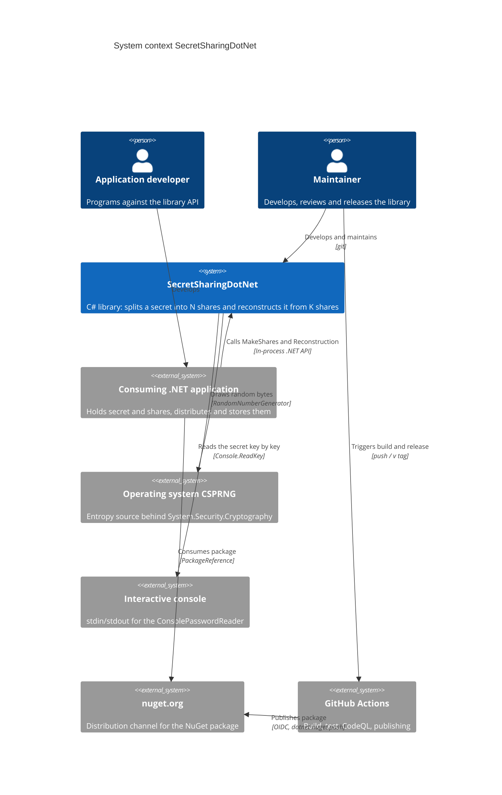
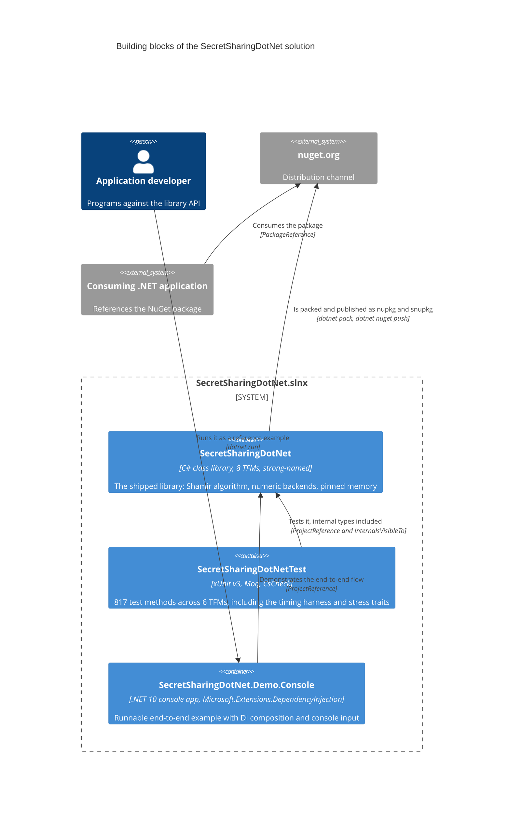
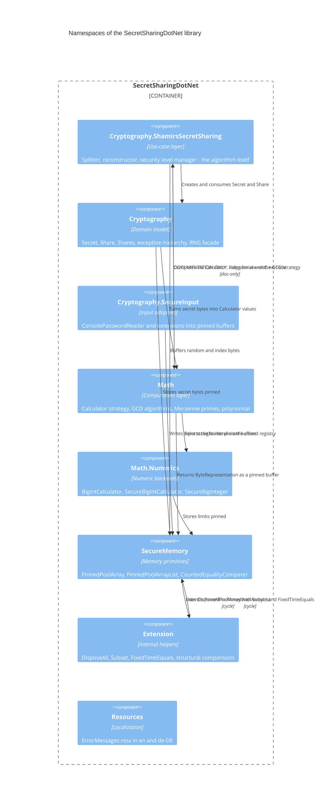
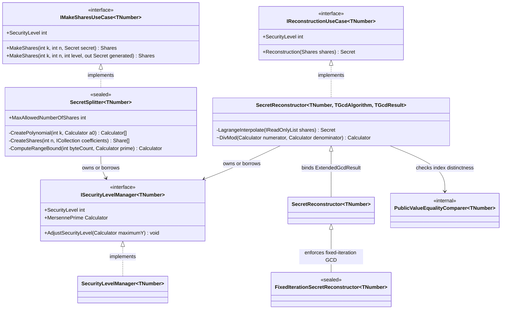
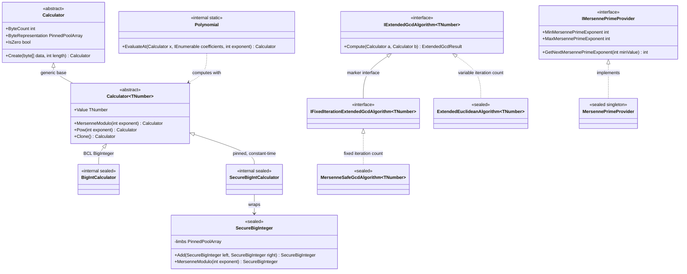
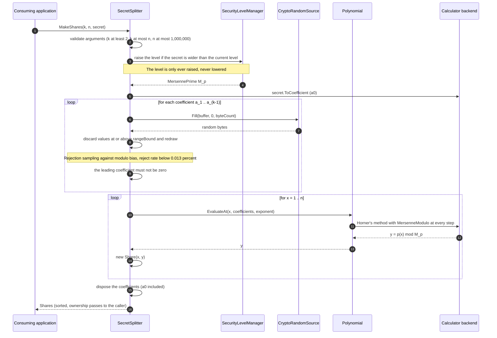
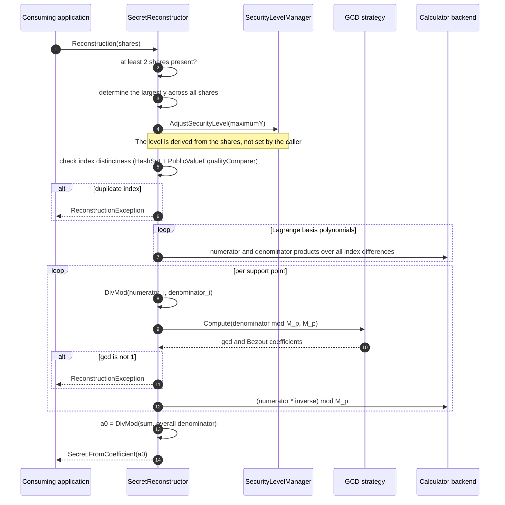
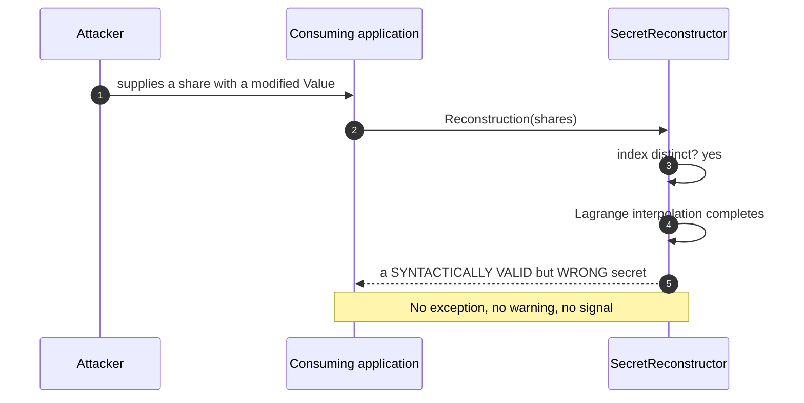
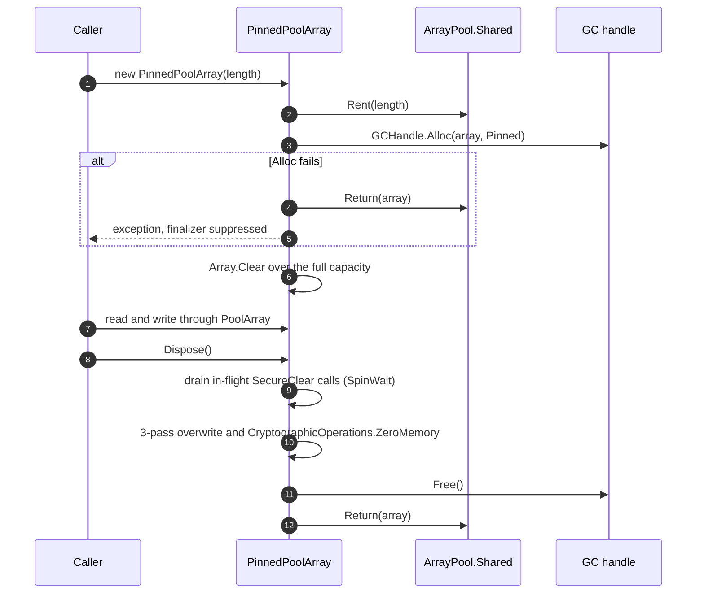
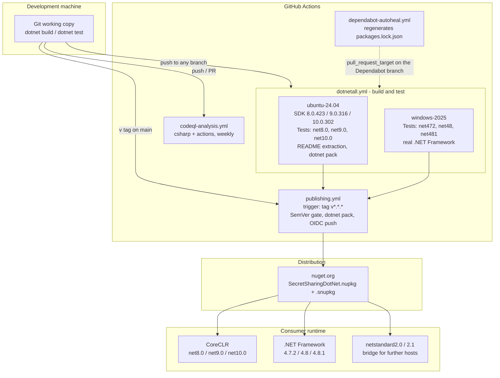

# Architecture Documentation: SecretSharingDotNet

- Date: 2026-09-12 · Version: 1.0
- Sources: codebase on `develop` (commit `d920257`, 47 `.cs` files / 13,702 LOC under `src/`),
  `README.md` (including the *Security & Threat Model* section), `CHANGELOG.md` (through
  `[1.0.1]`, 2026-08-24), the test suite under `tests/` (56 `.cs` files, including
  `tests/Timing/`), `.github/workflows/*.yml`, `samples/SecretSharingDotNet.Demo.Console/`, plus
  the public GitHub history (pull requests and issues, cited by number in chapters 9 and 11).
  Every reference in this document points at **versioned or publicly retrievable** content;
  local working files that are not under version control, and internal working notes, are
  deliberately not used as sources — what a reader does not find after `git clone` carries no
  statement here.
- Changes: 2026-09-12 — initial version, all chapters.
  · 2026-09-12 — chapters 5.2 and 11 followed up against the code.
  · 2026-09-12 — references to unversioned working files removed; the statements they carried in
    chapters 1.2, 5.2, 8.2, 8.11, 10.2, and 11 re-anchored onto versioned sources (test code, CI
    workflows, `README.md`).
  · 2026-09-12 — internal review identifiers (A…, SB/SEC/CR/PPA/SH…) removed from chapters 5.2, 9,
    and 11; the evidence column now names the code location or the public PR/issue number.
  · 2026-09-12 — chapter 2 extended with `.editorconfig` and `.gitattributes`, chapter 7 with the
    handling of the signing key in the release path.

Following [arc42](https://arc42.org). Content that cannot be sourced is marked as **Open:**
blocks naming the missing information.

---

## 1. Introduction and Goals

### 1.1 Requirements Overview

SecretSharingDotNet is a C# class library implementing *Shamir's Secret Sharing*: a secret (text,
number, or byte sequence) is split into **N** shares, any **K** of which suffice to recover the
original — while **K−1** shares mathematically reveal nothing about the secret. It targets .NET
developers who want to distribute keys, passwords, or recovery codes across several custodians
without trusting any single one.

Splitting itself is the entire purpose; **distribution, storage, and transport of the shares lie
outside the system** and are the consuming application's job. The library ships as a NuGet
package and runs in-process inside the consumer's application (source: `README.md`,
`src/SecretSharingDotNet.csproj`).

### 1.2 Quality Goals

| Priority | Quality goal | Motivation |
|---|---|---|
| 1 | **Confidentiality of the secret in process memory** | The library's whole value collapses if the secret stays recoverable from heap snapshots, swap files, or reused pool buffers. Realised via GC-pinned, triple-overwritten buffers (`PinnedPoolArray<T>`) and a pervasive `IDisposable` discipline. |
| 2 | **Functional correctness of the scheme** | A wrongly reconstructed secret is silently fatal: plain Shamir carries no integrity check (`README.md`, threat model). Backed by 817 test methods, property-based round-trip tests (CsCheck), and two parallel test hierarchies — one per numeric backend. |
| 3 | **Resistance to passive timing analysis (best effort)** | A deliberate second-rank security goal: the `SecureBigInteger` backend provides constant-time core arithmetic and a fixed-iteration modular inverse. The claim is explicitly *best effort in managed .NET*, not audited hardening (`README.md`, *Security & Threat Model* section). |
| 4 | **Portability across eight target frameworks** | The library should be usable in legacy .NET Framework applications as well as on .NET 10. Cost: extensive `#if` conditionalisation (see risk R1). |
| 5 | **Public API stability** | After the v1.0 GA, consumers should not break on every internal refactoring. Realised through deliberate `internal` boundaries and SemVer discipline in `CHANGELOG.md`. |

Priorities 1–3 drive chapter 8 (cross-cutting concepts) and chapter 10 (quality requirements);
priorities 4–5 drive chapters 2 and 7.

### 1.3 Stakeholders

| Role | Expectation |
|---|---|
| **Application developer (consumer)** | An API that is hard to use insecurely by accident; clear migration guidance on breaking changes; runnable examples (`samples/`, README). |
| **Maintainer** (Sebastian Walther, sole maintainer) | Maintainability under limited time; green CI across all eight TFMs as the release gate; traceable architecture decisions. |
| **Security reviewer / auditor** | An honestly scoped threat model — what is protected, and what explicitly is *not* (`README.md`, *Security & Threat Model*). |
| **Share holder (domain role)** | Keeps exactly one share in the `INDEX-VALUE` format (hexadecimal). Never interacts with the library directly — only through the consuming application. |
| **CI/release pipeline** | Deterministic, reproducible builds (lock files, `--locked-mode`, `Deterministic=true`) and a publishing path without long-lived secrets (OIDC). |

---

## 2. Architecture Constraints

**Technical**

| Constraint | Consequence |
|---|---|
| Target frameworks `netstandard2.0`, `netstandard2.1`, `net472`, `net48`, `net481`, `net8.0`, `net9.0`, `net10.0` | Every language or BCL advance must be conditionalised via `#if` (e.g. `Span<T>`, `CryptographicOperations.FixedTimeEquals`, `Convert.TryToBase64Chars`). |
| **Pure managed .NET** — no native interop, no P/Invoke dependency | Constant time is only approximately reachable in principle (RyuJIT, GC, ArrayPool). Stated openly in the threat model. |
| Runtime dependencies: only `System.Buffers` on `netstandard2.0` / `net4.7.2` / `net4.8` / `net4.8.1` | No transitive third-party crypto library; everything else comes from the BCL. |
| Strong-name signing (`SecretSharingDotNet.snk`), `ComVisible(false)`, `CLSCompliant(true)` | Public signatures must stay CLS-compliant; tests reach `internal` types only via `InternalsVisibleTo` with public key. |
| Central package management (`Directory.Packages.props`) with `packages.lock.json` and `--locked-mode` in CI | Every dependency update must regenerate the lock files across the full TFM matrix. |
| Single assembly (`SecretSharingDotNet.dll`) | Layer boundaries are a *convention* over namespaces, not compiler-enforced (see chapter 5.2 and risk R6). |
| Code style machine-readable in `.editorconfig` (359 lines, 161 `dotnet_`/`csharp_` rules), derived from the existing code base rather than from a template | Severity is `suggestion` throughout: the IDE hints, the build stays green. Neither `EnforceCodeStyleInBuild` nor a `dotnet format` step in CI — the style is binding by review, not by tooling. |
| Line endings normalised via `.gitattributes` (`* text=auto`; `.sh` and `.yml` pinned to `eol=lf`, `.snk`/`.gpg` as `binary`) | The repository stores LF while the working tree stays platform-native. Scripts and workflow files need LF at execution time and are therefore pinned explicitly. |

**Organizational**

- A single maintainer; no team capacity for parallel work streams. Larger changes are
  deliberately parked as "deferred" rather than started (see chapter 11).
- Development on `develop`, release through `main` with a `v*` tag; feature branches are
  rebased, never back-merged.
- CI exclusively on GitHub Actions; no self-hosted runners.

**Legal**

- MIT license (`LICENSE.md`, `PackageLicenseExpression=MIT`).
- The Bernstein–Yang "safegcd" algorithm is implemented from the paper (IACR ePrint 2019/266),
  explicitly **not** from existing third-party code (BoringSSL, libsodium) — documented in
  `MersenneSafeGcdAlgorithm.cs`, section *Implementation provenance*.

---

## 3. Context and Scope

The library is an in-process building block with no runtime of its own, no network layer, and no
persistence layer. Its only real external interfaces are the .NET API towards the consuming
application, the operating system's CSPRNG, and — optionally — the interactive console.



### Interfaces

| Partner | Exchanged data | Channel / mechanism |
|---|---|---|
| Consuming .NET application | `Secret<TNumber>` in, `Shares<TNumber>` out (split); `Shares<TNumber>` in, `Secret<TNumber>` out (reconstruct) | In-process method call through `IMakeSharesUseCase<TNumber>` / `IReconstructionUseCase<TNumber>` |
| Consuming .NET application (serialization) | A share as `INDEX-VALUE`, both parts hexadecimal; secret optionally as Base64 | `Share<TNumber>.ToCharArray()`, `Shares<TNumber>.ToCharArray()`, `Secret<TNumber>.ToBase64CharArray()` — each into pinned buffers |
| Operating system CSPRNG | Raw random bytes for polynomial coefficients, random secrets, and the mark byte | `System.Security.Cryptography.RandomNumberGenerator` via the internal `SecureRandom` / `IRandomSource` facade |
| Interactive console | The user's keystrokes, written straight into a pinned `PinnedPoolArray<char>` | `Console.ReadKey(intercept: true)` in `ConsolePasswordReader` — no managed `string` is materialised at any point |
| nuget.org | `SecretSharingDotNet.nupkg` + `.snupkg` (symbol package) | `dotnet nuget push` from `publishing.yml`, authenticated via OIDC |

**Deliberately out of scope:** distributing shares to custodians, storing them, protecting share
integrity (no VSS, no MACs — see risk R9), and any form of key management.

---

## 4. Solution Strategy

| # | Fundamental decision | Rationale and effect |
|---|---|---|
| 1 | **Finite fields over Mersenne primes** rather than arbitrary primes | `MersennePrimeProvider` holds 43 known Mersenne exponents (13 through 43,112,609). `M_p = 2^p − 1` allows reduction as fold-and-add (`MersenneModulo`) instead of a division, and is what makes the `2^{-n}` correction of the safegcd inverse possible at all. Shapes chapters 5.4 and 6. |
| 2 | **Strategy pattern for the numeric backend type** (`Calculator<TNumber>`) | Fully decouples the Shamir algorithm from the number type. Two implementations: `BigIntCalculator` (BCL `BigInteger`, fast, variable time) and `SecureBigIntCalculator` over the in-house `SecureBigInteger` (pinned, constant-time core arithmetic). The consumer chooses via the type parameter. |
| 3 | **Pinned, securely wiped memory as the default carrier of every secret** | `PinnedPoolArray<T>` is the only store for secret bytes, share characters, console input, and `SecureBigInteger` limbs. It forces the `IDisposable` discipline across the whole API (quality goal 1). |
| 4 | **Two reconstructor variants instead of one switch** | `SecretReconstructor<TNumber>` accepts any GCD strategy (including the variable-time `ExtendedEuclideanAlgorithm`). `FixedIterationSecretReconstructor<TNumber>` accepts only `IFixedIterationExtendedGcdAlgorithm<TNumber>` — so the dangerous "SecureBigInteger + Euclid" pairing is a **compile error**, not a silent weakness. |
| 5 | **Use-case interfaces as the public entry points** | `IMakeSharesUseCase<TNumber>` and `IReconstructionUseCase<TNumber>` extend `IDisposable` and are DI-friendly; the concrete types are `sealed`. Composition rather than inheritance is the intended extension direction. |
| 6 | **Redaction by default** | `ToString()` on `Secret`, `Share`, and `Shares` returns the sentinel `"*** Secured Value ***"` in Release builds; only the explicit `ToCharArray()` paths hand out real content. Prevents leaks through logs, exception messages, and debugger displays. |
| 7 | **UTF-8 as the text encoding** (since v0.14.0, breaking change) | A platform-neutral standard; the previous UTF-16 was a .NET artefact. Overloads taking an explicit `Encoding` exist, but the encoding is **not** persisted in the share (see risk R11). |
| 8 | **Closed backend registry instead of reflection** | `Calculator.Create<TNumber>()` resolves through an explicit `IReadOnlyDictionary<Type, BackendRegistration>`. Trimming- and NativeAOT-safe, free of static-initialisation-order coupling (ADR candidate 1 in chapter 9). |

---

## 5. Building Block View

### 5.1 Whitebox Overall System (level 1)

The solution `SecretSharingDotNet.slnx` contains exactly three projects. Only the first one ships.



| Building block | Responsibility | Technology |
|---|---|---|
| **SecretSharingDotNet** | All domain and cryptographic logic. The only artefact with a public API. | C#, `LangVersion=latest`, 8 TFMs, `AllowUnsafeBlocks`, `GenerateDocumentationFile` |
| **SecretSharingDotNetTest** | Verification across 6 TFMs (the `netstandard` targets are covered through the concrete frameworks). Contains two mirrored test hierarchies — one per numeric backend. | xUnit v3, Moq, CsCheck (net8+ only) |
| **SecretSharingDotNet.Demo.Console** | Reference composition: `SecureBigInteger` + `FixedIterationSecretReconstructor` + `ConsolePasswordReader`, wired through `Microsoft.Extensions.DependencyInjection` with `ValidateOnBuild`/`ValidateScopes`. Not packaged (`IsPackable=false`). | .NET 10, MS.DI |

### 5.2 Whitebox of the Library (level 2)

The library is a single assembly; its building blocks are namespaces. The diagram shows the
**actual** dependencies taken from the `using` directives — including both anomalies.



| Building block | Responsibility | Public? |
|---|---|---|
| `Cryptography.ShamirsSecretSharing` | Splitting (`SecretSplitter<TNumber>`), reconstructing (`SecretReconstructor<…>`, `FixedIterationSecretReconstructor<TNumber>`), managing the security level (`SecurityLevelManager<TNumber>`). | yes |
| `Cryptography` | `Secret<TNumber>` (readonly struct over a pinned buffer), `Share<TNumber>` (sealed record, an `Index`/`Value` pair), `Shares<TNumber>` (sorted, read-only collection), the exception hierarchy, the internal RNG facade. | yes (RNG parts `internal`) |
| `Cryptography.SecureInput` | Input without `string` materialisation: `ConsolePasswordReader`, `SecureCharBufferExtensions`, `SecureNumericBufferExtensions`. | yes |
| `Math` | `Calculator`/`Calculator<TNumber>` (strategy + closed backend registry), `Polynomial.EvaluateAt` (Horner's method), `ExtendedEuclideanAlgorithm<TNumber>`, `MersenneSafeGcdAlgorithm<TNumber>`, `MersennePrimeProvider`. | yes (`Polynomial` is `internal`) |
| `Math.Numerics` | `SecureBigInteger` (2,753 LOC, pinned `ulong` limbs, constant-time core operations) and the two `Calculator` implementations. | `SecureBigInteger` yes, the calculators `internal` |
| `SecureMemory` | `PinnedPoolArray<T>`: `ArrayPool` rent + `GCHandle.Alloc(Pinned)` + 3-pass overwrite + `CryptographicOperations.ZeroMemory` on dispose, with a concurrency counter. | yes |
| `Extension` | Exclusively `internal`: `DisposeAll`, `Subset<T>`, `FixedTimeEquals`, structural comparison helpers. | no |
| `Resources` | `ErrorMessages.resx` (neutral/en) and `ErrorMessages.de-DE.resx`, 55 keys each. All exception texts come from here, never inline. | `internal` |

**Two honest anomalies in the diagram:**

1. `Math → Cryptography.ShamirsSecretSharing` is a **documentation-only edge**. In
   `MersenneSafeGcdAlgorithm.cs:33`, `using Cryptography.ShamirsSecretSharing;` exists purely so
   the `<see cref="SecretReconstructor{…}"/>` references in the XML comments resolve. Outside
   comments, no type from that namespace is referenced (verified). The compiler nonetheless sees
   an "upward" dependency.
2. `SecureMemory ↔ Extension` is a **genuine namespace cycle**:
   `SecureMemory/PinnedPoolArrayList.cs` calls `DisposeAll()` from `Extension`, while
   `Extension/PinnedPoolArrayExtensions.cs` extends `PinnedPoolArray<T>`. Both sides are
   `internal`, so the cycle is not part of the public API — but it exists.

The earlier upward edge `Math → Cryptography.SecureArray` was resolved in v1.0.1 by moving the
memory primitives into the neutral top-level namespace `SecureMemory` (`CHANGELOG.md`
`[1.0.1] → Changed`; PR #375).

### 5.3 Whitebox `Cryptography.ShamirsSecretSharing` (level 3)



Notable at this level:

- **The type carries the security guarantee.** `FixedIterationSecretReconstructor<TNumber>`
  accepts only `IFixedIterationExtendedGcdAlgorithm<TNumber>` in its constructor; the
  parameterless constructor plugs in `MersenneSafeGcdAlgorithm<TNumber>`. The risky combination
  of `SecureBigInteger` and a variable-time Euclid simply does not compile.
- **Ownership of the security level is explicit.** Splitter and reconstructor record in an
  `ownsSecurityLevelManager` flag whether they created the manager themselves — only then do
  they dispose it along with themselves.
- **`SecretReconstructor.SecurityLevel` is read-only.** Every `Reconstruction` call invokes
  `AdjustSecurityLevel(maximumY)` and would overwrite a caller-set level anyway; a setter would
  be a lie.
- **`PublicValueEqualityComparer<TNumber>`** exists because `SecureBigInteger.GetHashCode`
  deliberately hashes only public metadata (sign + limb count). Without this comparer every
  small share index would land in the same bucket and the distinctness check would degrade to
  O(n²) (`CHANGELOG.md` `[1.0.1] → Fixed`).

### 5.4 Whitebox `Math` (level 3)



- `Calculator.Create<TNumber>(byte[], int)` resolves the backend type through a **closed**
  `Dictionary<Type, BackendRegistration>`. On a type mismatch it disposes the orphaned instance
  and throws `NotSupportedException` — there is deliberately no public registration API.
- `MersenneSafeGcdAlgorithm` is **stateless** and derives the Mersenne exponent from the modulus
  passed at call time. It holds no `ISecurityLevelManager` reference and therefore cannot drift
  from the reconstructor consuming it.
- `MersennePrimeProvider` is a `Lazy` singleton over an immutable `int[]`, so it is safe to read
  from the hot path concurrently.

---

## 6. Runtime View

### 6.1 Splitting a secret (`MakeShares`)

The most important flow. It also shows where randomness enters and where the security level is
raised automatically.



Two non-obvious details:

- The x coordinate is encoded via `BinaryPrimitives.WriteInt32LittleEndian` so that both
  `Calculator` backends — which read bytes as signed little-endian two's complement — see the
  same number regardless of host endianness.
- `numberOfShares` must be **smaller than the Mersenne prime**, otherwise share indices collide
  modulo `M_p` and the Lagrange division would divide by zero. The splitter checks this upfront
  and throws an `ArgumentOutOfRangeException` naming the argument that is actually wrong.

### 6.2 Reconstructing a secret (`Reconstruction`)



Reconstruction evaluates the Lagrange interpolation polynomial at `x = 0`; the result is exactly
the constant term `a₀` — the secret. All intermediate values are `Calculator` instances and are
disposed on every path, including the error path, via `try/finally`.

### 6.3 Critical failure case: a tampered share

The most important flow the library does **not** catch — it belongs in this documentation because
it shapes what consumers may expect.



Plain Shamir carries no per-share integrity check. The library implements neither verifiable
secret sharing (Feldman, Pedersen) nor per-share MACs. Consumers whose threat model includes
share manipulation must layer their own integrity scheme on top — signed shares, HMAC-keyed
envelopes, or VSS (`README.md`, *Security & Threat Model*; risk R9).

### 6.4 Lifecycle of pinned memory



The order *wipe → unpin → return* is security-critical: if the buffer went back to the pool before
being wiped, another tenant could read plaintext. The `activeOperations` counter prevents a
concurrent `SecureClear` from still writing into a buffer that has already been returned.

---

## 7. Deployment View

The library has no runtime environment of its own — it runs inside the consumer's process. What
gets "deployed" is the NuGet package and the CI runs.



| Node | Purpose | Particularity |
|---|---|---|
| `ubuntu-24.04` | Build, tests of the CoreCLR TFMs, packaging | No Mono — the .NET Framework suites cannot run here. Additionally verifies that the two README headings used to extract the package README occur exactly once. |
| `windows-2025` | Tests for `net472`, `net48`, `net481` | Runs against the real .NET Framework, not Mono. |
| `publishing.yml` | Release | Starts only on tags shaped `v[0-9]+.[0-9]+.[0-9]+*`; the actual SemVer validation happens in a dedicated step, because GitHub's filter globs cannot express SemVer. Pushes to nuget.org via OIDC instead of a long-lived API key. Concurrency is per ref and deliberately **without** `cancel-in-progress` — a release interrupted between pack and push would be half published. |
| `dependabot-autoheal.yml` | Repair | Dependabot's NuGet updater writes back a `packages.lock.json` containing only one framework section, which breaks the `--locked-mode` restore with NU1004. The workflow regenerates the lock files across the full TFM matrix and pushes them into the PR. |

**The release path treats its two secrets differently.** The push to nuget.org goes through OIDC
and therefore needs no long-lived token at all. The strong-name key, by contrast, sits GPG-encrypted
in the repository (`.github/secrets/SecretSharingDotNetPublisher.snk.gpg`) and is decrypted at run
time by `decrypt_publisher_snk.sh`. The ordering is deliberate: the *Verify tag matches package
version* step — which checks `<Version>`, `AssemblyInformationalVersion`, and the tag link in
`PackageReleaseNotes` against the tag — runs **before** the decryption. A tag that does not match
the packed state aborts the run before the signing key exists in plaintext at all.

**Local development** differs in one point: on Linux/macOS the Framework TFMs need
`mono-complete`. Mono 6.8 occasionally writes `mono_crash.*.json` files into `tests/` — artefacts
of the runner shutdown *after* assertion reporting, not library defects; masked via `.gitignore`
(`README.md`, *CLI building instructions*).

> **Open:** GitHub reads `dependabot.yml` exclusively from the default branch. How the sync
> between `develop` and `main` is organised for workflow configuration changes is documented
> nowhere in the repository. Needed: a short release checklist in the repository (today it exists
> only as a working note).

---

## 8. Cross-cutting Concepts

### 8.1 Secure memory and ownership

Every secret-bearing byte lives in a `PinnedPoolArray<T>`: rented from `ArrayPool<T>.Shared`,
pinned via `GCHandle` (so the GC cannot relocate it and leave copies behind), overwritten three
times on dispose and zeroed with `CryptographicOperations.ZeroMemory`. The wipe routine carries
`[MethodImpl(NoInlining | NoOptimization)]` so the JIT cannot optimise it away — the same pattern
the BCL uses for `FixedTimeEquals`.

From this follows a **strict single-owner discipline** that runs through the entire API:

- `Secret<TNumber>`, `Share<TNumber>`, `Shares<TNumber>`, `Calculator`, `SecureBigInteger`,
  `ExtendedGcdResult<TNumber>`, and both use-case interfaces are `IDisposable`.
- Ownership is transferred explicitly: a `Share` owns its two `Calculator` instances, a `Shares`
  collection owns its shares and disposes them in a cascade.
- Whoever *borrows* a manager does not dispose it — that is what the `ownsSecurityLevelManager`
  flag is for.
- `Secret<TNumber>` is a `readonly struct` over a reference-type buffer. A struct copy aliases the
  same buffer; `Dispose` on *any* copy invalidates all of them. The XML documentation says so
  explicitly and advises against passing the type by value across dispose boundaries. Migration
  to a `sealed class` is queued for the next breaking-change cycle (risk R7).

### 8.2 Constant time — reach and limits

The claim is precisely scoped; its binding formulation lives in the *Security & Threat Model*
section of `README.md` and in the XML comments on `MersenneSafeGcdAlgorithm` and
`SecureBigInteger`:

| Protected | Not protected |
|---|---|
| Core arithmetic of `SecureBigInteger` (`Add`, `Subtract`, `Multiply`, `Square`, `Divide`, `Remainder`) — fixed limb count `max(l, r)`, branchless carry/borrow formulas | `Pow(int)` — variable on the *exponent* (which is treated as public) |
| `MersenneModulo` — constant on the public Mersenne exponent and limb count | Hex and Base64 decoders (`Share.GetHexValue`, `Secret.DecodeBase64Char`) — branchy range switches, classified as boundary parsers |
| `Equals` on `SecureBigInteger` and `Secret` — pre-padding to equal length, XOR-OR fold, uniform across all six TFMs | `Secret.CompareTo` and the `<`, `>`, `<=`, `>=` operators — short-circuit at the first differing byte and leak the common prefix length |
| `GetHashCode` — hashes only public metadata (sign + limb count, resp. payload length), never content | The outer iteration count of the modular inverse depends on the *selected security level*, which the share sizes reveal anyway |
| The outer iteration count of `MersenneSafeGcdAlgorithm` — fixed at the public Mersenne exponent | Per-iteration time of the same algorithm is **not** uniform (differing allocation counts per divstep branch) |

The variable-time number-theoretic methods (`Gcd`, `ModPow`, `Log`, `Log10`, `Log2`) were
**removed** from `SecureBigInteger` so they cannot be applied to secret material by accident. The
surface is deliberately narrow.

### 8.3 Randomness

Every random draw goes through `System.Security.Cryptography.RandomNumberGenerator`, wrapped in
the internal `SecureRandom` facade behind the `IRandomSource` interface (default implementation
`CryptoRandomSource.Instance`, stateless and thread-safe). There is no `System.Random` and no
home-grown PRNG. The interface is **deliberately `internal`** — a publicly injectable RNG source
in a secret-sharing library would be a footgun design; tests reach it via `InternalsVisibleTo`.

Two places draw randomness: the polynomial coefficients `a₁…a_{k−1}` (with rejection sampling
against modulo bias) and the mark byte at the end of every secret, which prevents negative values
under the two's-complement interpretation.

### 8.4 Error handling

Since v1.0.1 there is a dedicated domain hierarchy:

```
Exception
└── SecretSharingException          (root: any Shamir-domain failure)
    ├── InvalidShareException       (malformed share during parsing)
    └── ReconstructionException     (valid shares, but not reconstructible)
```

Deliberately **not** part of the hierarchy: plain argument validation on values passed directly by
the caller (negative index, fewer than two shares, invalid security level). Those stay in the
`ArgumentException` family. A `SecurityLevelException` was considered and rejected — its candidate
sites are genuine argument guards.

All exception texts come from `Resources/ErrorMessages.resx`; a hard-coded message inside `src/`
counts as a rule violation.

### 8.5 Localization

Two resource files with 55 keys each: `ErrorMessages.resx` (neutral, `en` via
`NeutralResourcesLanguage`) and `ErrorMessages.de-DE.resx`. The two key sets are reconciled **by
hand**; there is no build-time check (risk R10).

### 8.6 Redaction and diagnostics

`ToString()` on `Secret`, `Share`, and `Shares` is build-mode sensitive: in DEBUG builds it
returns the real content (for the debugger and `[DebuggerDisplay]`), in Release builds the string
`"*** Secured Value ***"`. Whoever needs content must take the explicit path
`ToCharArray()` / `ToBase64CharArray()` — which returns real content in both build modes, but in
pinned memory the caller disposes.

### 8.7 Serialization format

A share serialises as `INDEX-VALUE`, both parts hexadecimal, separated by `-`. Multiple shares are
concatenated line by line. The format carries **no** metadata: no security level, no threshold `k`,
no text encoding of the original secret. The security level is recomputed from the largest y value
during reconstruction; `k` follows implicitly from how many shares the caller supplies; the
encoding is the caller's responsibility (risk R11).

### 8.8 Multi-targeting

A single source tree serves eight TFMs. Conditionalisation goes through
`#if NET8_0_OR_GREATER`, `#if NETSTANDARD2_1_OR_GREATER`, and `#if DEBUG`. Typical cases:
`Span<T>` overloads, `CryptographicOperations.ZeroMemory` versus a `Volatile.Write`-based
replacement, `Convert.TryToBase64Chars` versus an inline 24-bit-window encoder, `[Serializable]`
constructors behind `#if !NET8_0_OR_GREATER` because of SYSLIB0051.

### 8.9 Concurrency

The contract is **asymmetric** and must be honoured at the call site:

- **Thread-safe:** `MersennePrimeProvider.Instance` (immutable `int[]` behind `Lazy`),
  `Calculator.Create` (reads from a read-only registry), `CryptoRandomSource.Instance`, all
  `Dispose` paths (`Interlocked.Exchange` flags), `SecurityLevelManager` internally (a `lock`
  around the prime swap).
- **Not thread-safe:** a **shared** `SecretSplitter` or `SecretReconstructor` instance. Both read
  and write the security level on every call; concurrent calls on the same instance can return
  wrong results. That is why the README's DI guidance registers the use cases as `Transient` or
  `Scoped` and only the stateless GCD strategy as `Singleton`.

The stress tests (`Category=Stress`) deliberately exercise only the *supported* scenario — one
instance per thread. A shared splitter is explicitly never claimed to be safe.

### 8.10 Dependency Injection

Both use-case interfaces are constructor-injectable; the demo project shows the wiring with
`Microsoft.Extensions.DependencyInjection`, including `ValidateOnBuild` and `ValidateScopes`. The
library itself, however, provides **no** `AddShamirsSecretSharing()` registration — consumers wire
things up by hand (risk R5).

### 8.11 Test conventions

The conventions live in no document of their own; they follow from the test suite itself and from
how the tests are executed in `.github/workflows/dotnetall.yml`. The figures below are measured at
code state `d920257` across the 56 versioned test files:

- **AAA markers** (`// Arrange` / `// Act` / `// Assert`) structure the test bodies: 763
  `// Arrange` and 741 `// Act` markers across 43 of the 56 test files. Single-line
  `Assert.Throws` tests go without; where action and assertion are inseparable, a combined
  `// Act & Assert` marker stands in.
- **Every allocation binds with `using`** — including operator results (`+`, `-`, `*`, `/`, `%`),
  `Calculator<T>.Zero/One/Two`, inline expected values, and loop intermediates; 1,209 `using var`
  declarations across 817 test methods. A forgotten `using` keeps a pinned buffer alive until
  AppDomain shutdown.
- **Two mirrored test hierarchies**, one for `BigInteger` and one for `SecureBigInteger` — visible
  in the sibling directories `tests/Cryptography/{BigInteger,SecureBigInteger}/`,
  `tests/Cryptography/ShamirsSecretSharing/{BigInteger,SecureBigInteger}/`, and
  `tests/Math/{BigInteger,SecureBigInteger}/`. When one side diverges, that is an early warning of
  API drift between the backends.
- **Single-threaded execution**: every one of the twelve `dotnet test` invocations in
  `.github/workflows/dotnetall.yml` and `.github/workflows/publishing.yml` — and likewise the CLI
  instructions in `README.md` — sets `RunConfiguration.MaxCpuCount=1`, `xUnit.AppDomain=denied`,
  `xUnit.ParallelizeAssembly=false`, and `xUnit.ParallelizeTestCollections=false`. Required so
  that timing- and memory-sensitive invariants hold deterministically.
- The **timing harness** (`tests/Timing/`, net8+ only) takes paired measurements and evaluates them
  with Welch's t-test; the significance threshold is the default `pThreshold = 0.001` in
  `tests/Timing/DudectStyleClassifier.cs:58`. It runs as a **negative control**: the only test
  method carrying `[Trait("Category", "Timing")]` is
  `HarnessSelfTest.Multiply_OnDistinctOperandSizes_DetectedAsVariableTime`, and it must detect a
  known variable-time operation as such. Positive CT-claim tests are deliberately *not* part of
  the suite — in pure managed .NET the noise floor from ArrayPool, pinning, and JIT effects sits
  above the test's sensitivity threshold. The CT property is therefore defended **structurally**
  in code review, not statistically.

> **Open:** None of these conventions is machine-enforced — there is no analyzer and no CI step
> checking AAA markers, `using` binding, or the mirroring of the two test hierarchies, and no
> versioned file stating them normatively. What stands above is a measurement of the current
> state, not a guarantee. Needed: the decision whether the conventions should be binding — and if
> so, an analyzer rule set or CI check plus a versioned conventions document this chapter can
> point to.

---

## 9. Architecture Decisions

| ADR | Title | Status | Link |
|---|---|---|---|
| — | — | — | — |

> **Open:** The repository contains **no ADRs**. There is neither a `docs/decisions/` nor a
> `docs/adr/` directory. Today the decisions are scattered across `CHANGELOG.md`, XML comments,
> the README's *Security & Threat Model* section, and internal working notes — traceable, but not
> documented as decisions with context, options, and consequences. Needed: one ADR each (MADR
> format, DE/EN pair) for the candidates listed below.

**Candidates for decisions still to be documented** (evidenced, but not captured as ADRs):

| # | Decision | Evidence | Why it deserves an ADR |
|---|---|---|---|
| 1 | Closed backend registry instead of reflection-based discovery in `Calculator.Create` | `src/Math/Calculator.cs`, PR #374 | The rejected alternative (a public `Register` API) was a deliberate trade-off between extensibility and footgun avoidance. |
| 2 | Memory primitives moved to `SecretSharingDotNet.SecureMemory` instead of an interface abstraction | `CHANGELOG.md` `[1.0.1]`, PR #375 | A public namespace break; the alternative (`IByteRepresentation`) was evaluated and rejected. |
| 3 | Exception hierarchy rooted at `SecretSharingException`, **without** a `SecurityLevelException` | `CHANGELOG.md` `[1.0.1]`, PR #371 | The omission is a decision *against* something and would be breaking to reverse later. |
| 4 | `FixedIterationSecretReconstructor` as a type rather than a configuration switch | `CHANGELOG.md` `[1.0.1-rc02]`, `README.md` | Makes a security property compile-time checkable; needs explaining against the obvious boolean-option alternative. |
| 5 | UTF-8 instead of UTF-16 as the text encoding (breaking change v0.14.0) | `CHANGELOG.md` `[0.14.0]`, `README.md` | Breaks every text share produced by older versions. |
| 6 | `IRandomSource` stays `internal` rather than publicly injectable | `src/Cryptography/IRandomSource.cs`, PR #334 | A deliberate forfeit of external testability convenience for security reasons. |
| 7 | Mutation testing (Stryker.NET) parked instead of repaired | GitHub issue #343 | A quality measure was actively rolled back — the reason (Stryker cannot measure xUnit v3) deserves recording. |
| 8 | Eight target frameworks retained despite the `#if` cost | `src/SecretSharingDotNet.csproj:8` | The counter-position (netstandard2.0 + net8/9/10 only) is already on the table; retention is the active decision. |

---

## 10. Quality Requirements

### 10.1 Quality tree

```
Quality of SecretSharingDotNet
├── Security (goals 1 and 3)
│   ├── Confidentiality in memory ............ Q1, Q2
│   ├── Randomness quality ................... Q3
│   └── Timing resistance (best effort) ...... Q4, Q5
├── Functional suitability (goal 2)
│   ├── Round-trip correctness ............... Q6, Q7
│   └── Backend equivalence .................. Q8
├── Portability (goal 4)
│   └── TFM coverage ......................... Q9
├── Maintainability
│   ├── Test coverage and conventions ........ Q10
│   └── Build reproducibility ................ Q11
└── Usability (API)
    └── Misuse becomes a compile error ....... Q12
```

### 10.2 Quality scenarios

| # | Scenario | Measure / evidence |
|---|---|---|
| **Q1** | An attacker obtains a heap dump or the process swap file after a `Secret` has been disposed. | The secret bytes are no longer findable: the buffer was overwritten three times and zeroed with `CryptographicOperations.ZeroMemory` **before** it went back to the `ArrayPool`. Evidence: `PinnedPoolArrayTest`, dispose ordering in `PinnedPoolArray.DisposeCore`. |
| **Q2** | The GC performs a compacting collection during a split operation. | No secret byte is copied and no plaintext is left at the old address, because every buffer is immobile via `GCHandle.Alloc(Pinned)`. |
| **Q3** | An auditor asks for proof that no weak random source is involved. | There is exactly one random source: `RandomNumberGenerator` behind `SecureRandom`/`IRandomSource`. A `grep` for `System.Random` in `src/` returns zero hits. |
| **Q4** | A passive observer times `SecureBigInteger.Equals` for two secrets with a long common prefix against two that differ in the first byte. | No measurable difference: pre-padding to `max(l, r)` plus an XOR-OR fold without short-circuiting, uniform across all six TFMs. |
| **Q5** | The same observer times `SecureBigInteger.Multiply` with small versus 512-bit operands. | The timing harness **must** report a difference here (`HarnessSelfTest`, Welch's t at p < 0.001). If this negative control fails, the harness is measuring nothing real and is invalid as a tool. |
| **Q6** | A secret is split with an arbitrary `2 ≤ k ≤ n`; then an **arbitrary** k-element subset of the n shares is used for reconstruction. | The reconstructed secret is bit-identical to the original. Evidence: property-based tests with CsCheck (250 iterations for `BigInteger`, 50 for `SecureBigInteger`), mirrored across both backends. |
| **Q7** | Two shares with an identical index are handed to reconstruction. | `ReconstructionException` on the first duplicate — not after full enumeration, and not as a generic `ArgumentException`. |
| **Q8** | A behaviour is changed in the `BigInteger` test hierarchy but not in the `SecureBigInteger` one. | The mirrored test turns red. The mirroring is the brake against drift between the backends. |
| **Q9** | A commit reaches `develop`. | Build and tests pass on **all** six test TFMs: `net8.0`/`net9.0`/`net10.0` on `ubuntu-24.04`, `net472`/`net48`/`net481` on `windows-2025`. A red TFM blocks the merge. |
| **Q10** | A new test is written. | It carries AAA markers, binds every allocation with `using`, and exists in both backend hierarchies (chapter 8.11). Enforcement is by review, not by tooling — see the open item in 8.11. Current state: 817 test methods (638 `[Fact]`, 179 `[Theory]`) across 44 test classes. |
| **Q11** | A release is built twice from the same tag. | Identical artefacts: `Deterministic=true`, `ContinuousIntegrationBuild` in CI, `--locked-mode` restore against `packages.lock.json`, SDK versions pinned exactly (8.0.423 / 9.0.316 / 10.0.302). |
| **Q12** | A consumer accidentally combines the `SecureBigInteger` backend with the variable-time `ExtendedEuclideanAlgorithm`. | If they use `FixedIterationSecretReconstructor<TNumber>`: a **compile error** (the constructor takes only `IFixedIterationExtendedGcdAlgorithm<TNumber>`). Through the base type `SecretReconstructor<TNumber>` the combination stays possible — that is a documented opt-out, not an accident. |

> **Open:** There is no non-functional *performance* target — no throughput or latency budget, no
> benchmark suite, no measurements. The timing harness measures uniformity, not speed. Needed: if
> performance is to be a goal, at least one scenario of the form "splitting a 256-bit secret into
> 3-of-7 shares completes in under X ms on reference hardware with backend Y".

---

## 11. Risks and Technical Debt

The table consolidates the architecture and security findings. The *Evidence* column names the
place where each finding can be re-checked — a file/line reference in the repository, a section
of `README.md`, or a public PR/issue number. **No open finding is High in the sense of an active
security hole**: the only two Medium findings on the secret path (`GetHashCode` hashed content
instead of metadata, and `Equals`/`GetHashCode` violated their contract) were closed with
PR #327. What remains is maintenance load, misuse risk, and documented trade-offs.

| # | Risk / debt | Severity | Impact | Mitigation | Evidence |
|---|---|---|---|---|---|
| **R1** | **Eight-TFM sprawl.** `net472`/`net48`/`net481` are outside mainstream support and force `#if` branches in almost every file. | High (maintenance) | Every new feature costs double implementation and double verification; Mono is required as an extra test runtime. | Drop the legacy TFMs in the next major; keep only `netstandard2.0` as a bridge plus `net8/9/10`. | `SecretSharingDotNet.csproj:8`; 51 `#if` branches under `src/` |
| **R2** | **`SecureBigInteger.cs` at 2,753 LOC** in a single, non-partial class mixing six responsibilities. | High (maintenance) | Blocks the planned migration of the core arithmetic to limb level; reviews are expensive. | Two stages: first a purely mechanical `partial class` split along the six clusters (public API delta zero), then optionally genuine internal helper types. Guarded by the existing test suite × 6 TFMs. | `src/Math/Numerics/SecureBigInteger.cs`, 2,753 lines |
| **R3** | **Mixed thread safety with no contract on the type.** Splitter and reconstructor mutate their security level; single-threaded test execution hides races. | High (correctness under misuse) | A splitter registered as a singleton returns wrong shares under load — with no error. | Warnings exist in README and demo; stress tests cover the *supported* pattern. Open: a `<remarks>` thread-safety contract on every class. | `SecretSplitter<TNumber>`, line 166; warning in `README.md` |
| **R4** | **No generic constraint on `TNumber`.** `Calculator<string>` compiles. | Medium (low practical impact) | Misuse only surfaces at runtime (`NotSupportedException` from `Calculator.Create`). | No clean common constraint is available: `INumber<T>` is net7+ and `SecureBigInteger` does not implement it. Deliberately left as is and documented. | `src/Math/Calculator.cs:74` — no constraint clause |
| **R5** | **No DI registration extension.** Consumers wire up by hand; the lifetime trap (transient/scoped rather than singleton) is only explained in the README. | Medium | Raises the likelihood of walking into R3. | An `AddShamirsSecretSharing()` extension; it presupposes the closed backend registry (PR #374) and the internal RNG facade (PR #334) — both in place. | `src/` contains no `IServiceCollection` extension |
| **R6** | **Namespace cycle `SecureMemory ↔ Extension`** and the documentation-only upward edge `Math → Cryptography.ShamirsSecretSharing`. | Low | No runtime effect (single assembly, both sides `internal` resp. comment-only), but the layering is no longer provably acyclic. | Resolve `PinnedPoolArrayList.DisposeAll` locally; replace the doc-only `using` with a fully qualified `cref`. | Chapter 5.2 (this document) |
| **R7** | **`Secret<TNumber>` is a `readonly struct` over a shared buffer.** A value copy aliases the memory; `Dispose` on one copy invalidates all. | Medium | A classic footgun for consumers; today guarded only by XML documentation. | Migration to a `sealed class` — queued for the next breaking-change cycle. | XDoc on `Secret<TNumber>`, from line 50 |
| **R8** | **No `IAsyncDisposable`; `ConsolePasswordReader.ReadPassword` blocks.** | Medium | Blocks threads in ASP.NET or worker hosts. | `IAsyncDisposable` on the large disposables; `ReadPasswordAsync(CancellationToken)`. | no `IAsyncDisposable` under `src/`; `ConsolePasswordReader.cs:86` |
| **R9** | **No per-share integrity check.** A tampered share yields a silent, wrong result (see flow 6.3). | Medium (deliberate, documented) | Consumers with share manipulation in their threat model are unprotected without their own measure. | Stated openly in the threat model; consumers must layer signed shares, HMAC envelopes, or VSS on top. A VSS implementation is not on the roadmap. | `README.md`, *Security & Threat Model* |
| **R10** | **No build-time check that the two `.resx` key sets match.** | Low | A missing de-DE key only surfaces at runtime (fallback to English). | A build target or analyzer diffing both key sets — or drop the de-DE resource. | `src/Resources/ErrorMessages.resx` and `…de-DE.resx`, 55 keys each |
| **R11** | **The text encoding is not persisted in the share.** Splitting with `Encoding` A and reconstructing with `Encoding` B yields silent garbage. | Low | Affects only those who deliberately use the `Encoding` overloads; the UTF-8 default is identical on both sides. | Document it as a caller responsibility on the `Encoding` overloads (open doc fix). | `CHANGELOG.md` `[0.14.0]`; `README.md` |
| **R13** | **Mutation testing measures nothing.** Stryker.NET 4.16.0 cannot instrument the xUnit v3/MTP suite; the first green CI run was a **false green** (0.00 %, 1248/1248 survived). | Low (externally blocked) | There is no solid statement about test sharpness beyond coverage. | Workflow parked, configuration kept as a revival aid; tracked in GitHub issue #343. Blocked by stryker-net #3117/#3094. | `.config/dotnet-tools.json` (Stryker 4.16.0); GitHub issue #343 |
| **R14** | **Deferred: constant time for the hex/Base64 decoders and `Secret.CompareTo`.** The former are branchy boundary parsers; the latter short-circuits at the first differing byte and leaks the common prefix length. | Low (named in the threat model) | Sorting or comparing secret material is observable in time; only equality is CT. | Branchless variants are designed and parked for a dedicated PR cycle; `[Obsolete]` markers on the relational operators are an option. | `README.md`, *Security & Threat Model* |
| **R15** | **`Secret.CreateRandom` is entropy-suboptimal for small security levels** (level 13/17 ≈ 8 bits, level 31 ≈ 24 bits; measured over 3000 draws). | Low | Affects only the small levels that are discouraged anyway; from level 127 upwards ≈ p−8 bits remain. | A localized fix (uniform rejection sampling) was implemented and **rejected**: it breaks the round trip, because the mark byte is coupled to the prime at the representation level. A real fix is architectural. | `Secret<TNumber>.CreateRandom`, from line 1128 |
| **R16** | **Further low/info footguns:** `PinnedPoolArray.PoolArray` hands out the raw buffer; `Secret` has implicit reveal conversions to `byte[]`/`ReadOnlySpan`; `Shares` silently takes ownership of a supplied share array; `(length + 7) / 8` can overflow on ~2 GB input; the reduction loop in `Secret.CreateRandom` is data-dependent. | Low | Each is a misuse risk, not an active hole. | Documented trade-offs; each can be hardened individually. | `PinnedPoolArray<T>.PoolArray` (l. 225), `Secret<TNumber>` (l. 577), `Shares<TNumber>` (l. 82), `SecureBigInteger` (l. 268), `Secret<TNumber>.CreateRandom` |
| **R17** | **No `MIGRATION.md`, no public v1.0 roadmap.** The API-freeze criteria exist only as an internal note. | Low | Consumers cannot judge the maturity level. | Add `MIGRATION.md` and a public roadmap. | repository contains no `MIGRATION.md` |
| **R18** | **Broad `InternalsVisibleTo` coupling.** The test suite reaches every `internal` type; refactoring resistance grows. | Low | Internal restructuring breaks tests even when the public API is unchanged. | Minimise the test surface where public-API tests suffice; document the remaining `internal` needs. | `src/Properties/AssemblyInfo.cs:25` |
| **R19** | **Single maintainer (bus factor 1).** | Medium (organizational) | A break stops security fixes and release capability. | This documentation is one contribution: it makes the architecture and the open items accessible without person-bound knowledge. | Chapter 2 (this document) |

The numbering R1–R19 stays stable across updates. The identifier **R12 is unassigned**: it
described the maintenance state of a local, unversioned working file and was therefore not a risk
of the repository.

**Resolved and therefore no longer risks** (for historical traceability): reflection-based
backend discovery (PR #374), the Math→Crypto upward edge (PR #375), the exception hierarchy
(PR #371), an injectable RNG source for tests (PR #334), property and stress tests
(PR #335/#336), the `GetHashCode` leak together with the `Equals`/`GetHashCode` contract
(PR #327), and the demo project (`samples/SecretSharingDotNet.Demo.Console/`).

---

## 12. Glossary

| Begriff (DE) | Term (EN) | Definition |
|---|---|---|
| Anteil | Share | A point `(Index, Value)` on the secret polynomial. Serialised as `INDEX-VALUE` in hexadecimal. |
| Geheimnis | Secret | The value to be protected (text, number, or bytes), `Secret<TNumber>` in code. Corresponds to the polynomial's constant term `a₀`. |
| Schwellwert | Threshold (k) | Minimum number of shares required for reconstruction. |
| Sicherheitsstufe | Security level | The chosen Mersenne prime exponent `p`; determines the finite field `GF(2^p − 1)` and thereby the share length. Valid values: 43 known exponents from 13 to 43,112,609. |
| Markierungsbyte | Mark byte | A random terminating byte (`0x1F`–`0x7F`) appended to the secret bytes that prevents negative values under the two's-complement interpretation. |
| Gepinnter Pool-Puffer | Pinned pool array | `PinnedPoolArray<T>`: rented from `ArrayPool`, immobile via `GCHandle`, overwritten three times on dispose. |
| Konstante Laufzeit | Constant time (CT) | Runtime depends only on public quantities (bit length, security level), not on secret values. Explicitly *best effort* here. |
| Verzweigungsfrei | Branchless | An implementation without data-dependent jumps — a prerequisite for constant time. |
| Erweiterter euklidischer Algorithmus | Extended Euclidean algorithm | Computes the gcd plus Bézout coefficients; its iteration count depends on the operand values. |
| Divstep / safegcd | Divstep / safegcd | The Bernstein–Yang recurrence with a **fixed** iteration count; the basis of `MersenneSafeGcdAlgorithm`. |
| Modulares Inverses | Modular inverse | The `x` with `a·x ≡ 1 (mod M_p)`; required in the reconstructor for division in the finite field. |
| Lagrange-Interpolation | Lagrange interpolation | The reconstruction method: determine the polynomial from `k` points and evaluate it at `x = 0`. |
| Horner-Schema | Horner's method | A polynomial evaluation scheme with a minimal number of multiplications; used here with a Mersenne reduction at every step. |
| Ablehnungsstichprobe | Rejection sampling | Discarding and redrawing random values above a bound in order to avoid modulo bias. |
| Redaktion / Schwärzung | Redaction | Replacing real content with `"*** Secured Value ***"` in Release builds. |
| Verifizierbares Secret Sharing | Verifiable Secret Sharing (VSS) | Schemes (Feldman, Pedersen) that make tampering with individual shares detectable — **not** implemented here. |
| Ziel-Framework | Target framework (TFM) | An identifier such as `net8.0` or `netstandard2.0` that code is compiled against. |
| Einzelbesitzer-Disziplin | Single-owner discipline | The convention that exactly one place owns and disposes an `IDisposable` resource. |
